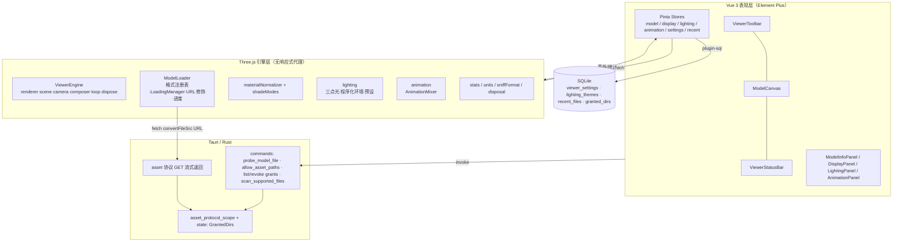
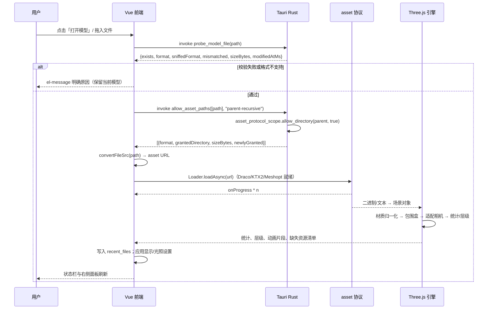
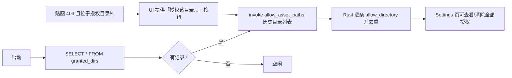
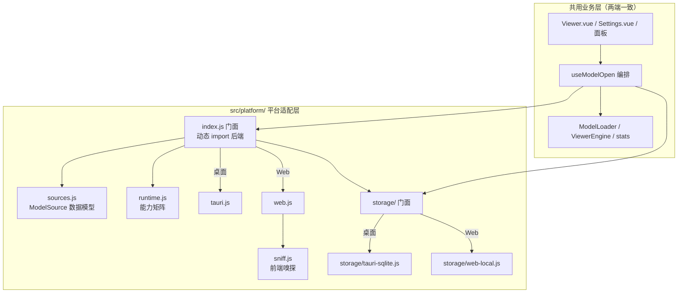

# 三维模型查看器 设计文档

- 项目：`model-viewer`（Tauri 2 + Vue 3 + Element Plus + Three.js）
- 版本：v1.6
- 修订记录：
  - v1.0 首版（可行性分析 + 详细方案 + 接口契约 + 表结构）
  - v1.1 M0 实施同步：`allow_asset_paths` 返回 `AllowReport{grants, errors}`；错误码 `GRANT_REFUSED_DRIVE_ROOT` 更名为 `GRANT_REFUSED_PROTECTED_DIR`（覆盖盘根与用户主目录）；补充 M0 实现状态（见 §14）
  - v1.2 新增双端适配章节（见 §15）：平台适配层、ModelSource 统一数据模型、共享测试向量、Web/桌面两套构建与已知限制
  - v1.3 M1 实施同步：相机与显示模式落地（见 §16），含测试暴露出的 `computeViewDistance` 非法 fov 缺陷修复
  - v1.4 模型摆放归一化（包围盒 → 世界原点居中 + 底部贴地），并同步 `viewer_settings` 实际键位
  - v1.5 M2 实施同步：层级树、边界框尺寸标注与单位换算（见 §17）；可见性解析层从着色模块中拆出，修复"用户隐藏被模式切换覆盖"
  - v1.6 M3 实施同步：三点光源、程序化环境贴图、5 个光照预设与自定义光照主题（见 §18）；HDR 导入调整到 M6
  - v1.7 M4 实施同步：动画片段选择与播放控制（播放/暂停/停止/倍速/时间轴/循环模式，见 §19）；含三处布局静默裁切修复（侧栏高度链、面板自滚、flex 子项收缩）
  - v1.8 M5 实施同步：补齐 FBX / OBJ(+MTL) / PLY / 3MF 四种格式（见 §20）；MTL 绝对路径重写与手动轴向覆盖的接线、HDR 导入一并明确留到 M6
  - v1.9 界面补充与 M6 规划：明暗主题（见 §21，UI 跟随、3D 视口不跟随）；动画控制条与信息 HUD 改为浮层；M6 范围、依赖与实施顺序（见 §22）

---

## 0. 可行性结论

| 需求域 | 可行性 | 结论依据 | 主要风险 |
|---|---|---|---|
| 多格式（FBX/OBJ/STL/PLY/GLB/GLTF/3MF） | **高** | Three.js 官方 addons 对 7 种格式全都有 loader（含 `ThreeMFLoader`） | 3MF 材质扩展仅部分支持；FBX 版本兼容性有历史坑 |
| 相机控制（旋转/平移/缩放） | **高** | `OrbitControls` 成熟稳定 | 无 |
| 转盘/自动旋转 | **高** | `controls.autoRotate` + 速度滑块 | 无 |
| 模型统计（顶点/面/层级） | **高** | `Object3D.traverse` + `geometry.attributes` 纯计算 | 大模型遍历需节流 |
| 多种着色模式 | **中高** | 需自建“材质策略层”（归一化 + 覆盖 + 恢复 + 线框/边线） | 大模型线框生成耗时；需异步 + 阈值保护 |
| 边界框尺寸检查 | **高** | `Box3` + `CSS2DRenderer` 标注 | 格式无单位，需单位选择器 |
| 光照参数调节 + 预设 + 主题 | **中高** | 三点光 + 程序化环境贴图（PMREM）+ 曝光/饱和度后处理 | 饱和度需后处理链；预设调色是主要工作量 |
| 动画选择/播放/暂停/停止/倍速 | **高** | `AnimationMixer` + `AnimationAction.timeScale` | FBX 轨道重映射的个别脏数据 |
| 大批量/超大模型（>100MB） | **中** | asset 协议流式（免 base64 IPC），WebView2 硬件加速 | 显存上限；加载无法真正中断 |
| Windows 桌面交付 | **高** | 本机 WebView2 153.0.4234.32 已装；MSVC（VS2026 Community，VC.Tools.x86.x64）+ cargo 齐备 | 打包体积含 Three.js |

**总评：完全可行。** 无技术性阻塞项，主要风险集中在“材质/光照的视觉一致性与大模型性能”两处，本文档内已给出对策。

---

## 1. 现状核查

### 1.1 仓库现状

- 模板项目：Tauri 2 + Vue 3.5 + Element Plus 2.13 + vue-router 4，`src/main.js` 全量引入 Element Plus。
- 已有插件：`tauri-plugin-log`（Stdout/LogDir/Webview 三目标，日志落在 `~/.model-viewer/app/app.log`）、`tauri-plugin-sql`（社区 fork `tuyu79/plugins-workspace#v2-sql-default`，SQLite）。
- DB：`src-tauri/migrations/0000_initial.sql` 仅一张 `tasks` 表；`src/utils/db.js` 用前端 `Database.load()` 直连 SQLite（**沿用此模式**）。
- 可复用资产：`lib.rs` 中 home 目录拼接、migration 数组、日志初始化——全部保留。
- 模板示例残留：`src/components/TaskList.vue`、`HelloWorld.vue`、`views/Home.vue`、`tasks` 表（与本应用无关）。
- 双 lockfile 并存：`package-lock.json` + `pnpm-lock.yaml`；`tauri.conf.json` 的 `beforeDevCommand` 为 `npm run dev`。

### 1.2 环境实测

| 项 | 实测结果 | 影响 |
|---|---|---|
| Node | v22.22.1（nvm 管理） | 需补 `.nvmrc` |
| 包管理器 | pnpm 11.x（`C:\Users\shunz\AppData\Local\pnpm\pnpm.CMD`） | 统一用 pnpm，本地依赖隔离 |
| Rust | `rustc`/`cargo` 位于 `D:\Environment\Scoop\persist\rustup\.cargo\bin`（stable-msvc） | 构建时需将 `CARGO_HOME`/`RUSTUP_HOME` 指向该 persist 目录 |
| MSVC | VS 2026 Community（`D:\Program Files\Microsoft Visual Studio\18\Community`，含 VC.Tools.x86.x64） | Tauri 可编译 |
| WebView2 | 153.0.4234.32 | WebGL2 可用 |
| 缺失 | 无 `three`、`pinia`、`@tauri-apps/plugin-dialog` | 见 §4.5 |

---

## 2. 关键技术结论（已逐项验证）

1. **7 种格式全部有官方 loader**：`GLTFLoader`、`FBXLoader`、`OBJLoader`（+`MTLLoader`）、`STLLoader`、`PLYLoader`、`ThreeMFLoader`。3MF 官方支持范围：3D Models / Object Resources（Meshes、Components）/ Material Resources（Base Materials）；材质与属性扩展部分支持：Texture 2D、Texture 2D Groups、Color Groups（顶点色）、Metallic Display Properties（PBR）、Beam Lattice。Three.js 当前最新 `0.185.x`。
2. **文件读取走 Tauri asset 协议，不自建协议**。核对 `tauri/crates/tauri/src/protocol/asset.rs` 源码：
   - 响应带 `Access-Control-Allow-Origin: <window_origin>` → dev 态（`http://localhost:5173`）与生产态（`http://tauri.localhost`）的跨源 fetch 均不会被 CORS 拦；
   - 支持 `Range`（单段/多段 206，单段上限 1000KB）；
   - scope 校验 `scope.is_allowed(percent_decode(path))`：越权 403、不存在 404、路径非法 403。
3. **scope 可在运行时扩展**：`app.asset_protocol_scope()` 提供 `allow_file` / `allow_directory(path, recursive)`（官方 `persisted-scope` 插件即调用此 API）。因此 `assetProtocol.scope` 可静态留空，由用户在“打开/拖入”时按需授权。
4. **需开启 Cargo feature**：`tauri = { features = ["protocol-asset"] }`。
5. **拖放**：Tauri 2 默认 `dragDropEnabled: true` 会吞掉 HTML5 拖放，必须用 `getCurrentWebview().onDragDropEvent()`；payload 形如 `{type:'enter'|'over'|'drop'|'leave'}`，`drop` 携带 `paths: string[]` 与 `position`。保持默认 true，用原生事件拿绝对路径。
6. **解码器本地化**：GLB 需要 `DRACOLoader('/draco/')`、`KTX2Loader('/basis/').detectSupport(renderer)`、`MeshoptDecoder`；draco/basis 的 wasm 从 npm 包 `three/examples/jsm/libs/{draco,basis}` 复制到 `public/`（Node 脚本复制，跨平台，不引第三方插件）。
7. **CSP**：当前 `csp: null`（不限制）。日后收紧必须补 `connect-src 'self' asset: http://asset.localhost`、`img-src ... asset: http://asset.localhost blob: data:`。
8. **魔数嗅探不走 Range fetch**：为消除 CORS 预检的不确定性，改用 Rust `probe_model_file` 直接读前 16 字节（Rust 侧无 scope 限制，且可顺带返回 size/mtime）。

---

## 3. 选型对比

| 方案 | 结论 |
|---|---|
| **Three.js（选用）** | 7 种目标格式官方 loader 全覆盖（含 3MF、FBX），社区最大，`0.185` 体积对桌面应用无压力，后处理/环境贴图生态完整 |
| `<model-viewer>` Web Component | 仅 GLB/GLTF，无 FBX/OBJ/STL/3MF，无层级树/光照调节 → 不可行 |
| Babylon.js | 内置 STL/OBJ/GLTF，但 3MF 无官方 loader、FBX 需转换链，包体更大 → 放弃 |
| 原生 Rust 渲染（bevy/egui） | 与“Vue + Element Plus UI”需求冲突，格式支持还需自研 → 放弃 |

---

## 4. 总体架构

### 4.1 分层与数据流



### 4.2 前端目录结构（新增/改动）

```
src/
  main.js                        改：注册 Pinia + Element Plus 暗色变量
  App.vue                        改：整体 el-container 布局
  router/index.js                改：/ → Viewer，/settings → Settings
  views/Viewer.vue               新增：页面骨架（工具栏/画布/侧栏/状态栏/空态）
  views/Settings.vue             新增：授权目录、性能、默认值、关于
  components/layout/ViewerToolbar.vue
  components/layout/ViewerStatusBar.vue
  components/layout/EmptyDropHint.vue
  components/layout/LoadingOverlay.vue
  components/viewer/ModelCanvas.vue        画布挂载 + 引擎生命周期 + 拖放 + ResizeObserver
  components/viewer/BoundingBoxOverlay.vue 尺寸标注（CSS2DRenderer 层）
  components/panels/ModelInfoPanel.vue     统计 + el-tree 层级 + 边界框 + 单位
  components/panels/DisplayPanel.vue       着色模式/背景/网格/坐标轴/轴向修正/单位
  components/panels/LightingPanel.vue      预设 + 三点光编辑 + 主题管理
  components/panels/LightSourceEditor.vue
  components/panels/AnimationPanel.vue     片段列表 + 播放/暂停/停止/倍速/时间轴
  core/three/ViewerEngine.js       渲染器/相机/控制器/后处理/循环/尺寸/销毁
  core/three/ModelLoader.js        格式注册表、LoadingManager、进度、错误归类、取消令牌
  core/three/materialNormalizer.js 材质归一化与默认黏土材质
  core/three/shadeModes.js         着色模式应用/还原、边线与全线框生成（含阈值保护）
  core/three/lighting.js           三点光、程序化环境贴图（PMREM）、预设应用、饱和度
  core/three/animation.js          AnimationMixer 封装
  core/three/stats.js              纯函数：几何与层级统计
  core/three/units.js              纯函数：单位换算与格式化
  core/three/sniffFormat.js        纯函数：魔数 → 格式判定与冲突提示
  core/three/disposal.js           资源释放遍历（geometry/material/texture/renderTarget）
  composables/useViewerEngine.js
  composables/useModelOpen.js      打开/拖放/最近文件/加载编排
  composables/useAssetScope.js     invoke 包装、授权目录管理
  composables/useHotkeys.js
  stores/{model,display,lighting,animation,settings,recent}Store.js
  utils/tauri-io.js                dialog / invoke / convertFileSrc / 拖放注册 / logger
  utils/db.js                      改：新增表 CRUD + settings KV
  constants/formats.js             扩展名 ↔ 格式 ↔ loader ↔ 中文标签
  constants/presets/lightingPresets.js  纯数据预设（可单测）
scripts/copy-decoders.mjs          复制 draco/basis 到 public/
public/draco/**, public/basis/**   生成物（加入 .gitignore）
tests/fixtures/models/**           各格式小样本 + README 来源与许可
docs/设计文档.md / docs/THIRD_PARTY.md
```

### 4.3 后端目录结构（src-tauri/src）

```
lib.rs              仅做装配：插件、迁移、state、invoke_handler（保持薄）
app_state.rs        GrantedDirs(Mutex<HashSet<PathBuf>>)
asset_scope.rs      纯逻辑：ModelFormat 枚举、扩展名解析、scope 授权计划、路径校验（#[cfg(test)] 全覆盖）
commands/mod.rs
commands/asset.rs   probe_model_file / allow_asset_paths / list_asset_grants / revoke_asset_grants / scan_supported_files
migrations/0001_viewer.sql   一个 version 建全部新表
```

### 4.4 架构硬规则

1. **Three.js 对象永不进入 Vue 响应式**：引擎、场景、材质一律 `shallowRef` / `markRaw` 或纯 JS 类实例持有；Pinia 只存可序列化描述（模式枚举、数值、路径）。
2. Rust command 一律 `async`；每个 command 在关键节点打日志（复用 `tauri-plugin-log`）。
3. 尺寸/坐标/路径计算不依赖平台命令，纯 `std::fs` / `std::path`（跨平台）；不使用 `~` 拼接用户目录，统一 `dirs::home_dir()` / `app.path()`。
4. 不引入 `tauri-plugin-fs`：模型字节全部走 asset 协议，元数据走 Rust command，减少权限面。

### 4.5 依赖与配置变更

**package.json（dependencies）**：`three@^0.185`、`pinia@^3`、`@tauri-apps/plugin-dialog@^2`
**devDependencies**：`vitest@^3`（仅纯函数单测，不引 jsdom）
**scripts**：
```json
{
  "dev": "node scripts/copy-decoders.mjs && vite",
  "build": "node scripts/copy-decoders.mjs && vite build",
  "test": "vitest run"
}
```
（显式串联复制，不依赖 npm/pnpm 的 pre 脚本差异）

**src-tauri/Cargo.toml**：`tauri = { version = "2.10", features = ["devtools", "protocol-asset"] }`，新增 `tauri-plugin-dialog = "2"`。

**src-tauri/tauri.conf.json**：`app.security.assetProtocol = { "enable": true, "scope": [] }`；窗口 `title: "三维模型查看器"`、`1280×800`、`minWidth/minHeight`；`dragDropEnabled` 保持默认 `true`；Phase 6 追加 `bundle.fileAssociations`（7 种扩展名，`role: "Viewer"`）。

**vite.config.js**：补 `clearScreen: false` 与 `server: { port: 5173, strictPort: true, watch: { ignored: ['**/src-tauri/**'] } }`。

**工程规范**：新增 `.nvmrc`（`22.22.1`）；统一 pnpm，删除 `package-lock.json`，`beforeDevCommand`/`beforeBuildCommand` 改 `pnpm dev` / `pnpm build`。

---

## 5. 前后端交互流程与接口契约

### 5.1 打开模型主流程



### 5.2 授权与启动重授权



### 5.3 Command 契约（JSON）

```jsonc
// 1) 打开前探测（不改动授权状态）
// invoke("probe_model_file", { path: "E:\\models\\robot.glb" })
{
  "path": "E:\\models\\robot.glb",
  "fileName": "robot.glb",
  "exists": true,
  "format": "glb",            // 由扩展名解析；未知为 null
  "sniffedFormat": "glb",     // 由魔数嗅探；无法判定为 null
  "mismatched": false,        // 扩展名与魔数冲突（如 .gltf 实为 glb）
  "sizeBytes": 12345678,
  "modifiedAtMs": 1767225600000,
  "isZipContainer": false     // 3MF 为 PK 头
}
// 失败即 Err，前端 catch 到带前缀的错误码：
// "UNSUPPORTED_FORMAT: .abc" | "FILE_NOT_FOUND: E:\\x" | "NOT_A_FILE: E:\\dir"
// | "PERMISSION_DENIED: ..." | "IO_ERROR: ..."

// 2) 授权（单条/批量同一入口；启动重授权也走它）
// invoke("allow_asset_paths", { paths: ["E:\\models\\robot.glb"], grantMode: "parent-recursive" })
// 返回 AllowReport：批量时逐条返回，坏路径不会让整批作废；单条调用失败则直接 Err(错误码)
{
  "grants": [
    {
      "path": "E:\\models\\robot.glb",
      "fileName": "robot.glb",
      "format": "glb",
      "sizeBytes": 12345678,
      "grantedDirectory": "E:\\models",
      "grantedRecursive": true,
      "newlyGranted": true
    }
  ],
  "errors": [ { "path": "E:\\broken.obj", "code": "FILE_NOT_FOUND: E:\\broken.obj" } ]
}
// grantMode: "file" | "parent" | "parent-recursive"（默认 parent-recursive，覆盖 OBJ+MTL+贴图 子目录场景）
// Err 错误码："GRANT_REFUSED_PROTECTED_DIR: E:\\" | "GRANT_LIMIT_EXCEEDED: 32"
//            | "INVALID_GRANT_MODE: xxx" | "GRANT_APPLY_FAILED: ..."

// 3) 授权清单
// invoke("list_asset_grants")
{ "dirs": [ { "path": "E:\\models", "recursive": true, "grantedAtMs": 1767225600000 } ] }

// 4) 撤销全部授权
// invoke("revoke_asset_grants") → { "revoked": 3 }

// 5) （Phase 6，可选）拖入目录时枚举受支持的模型文件
// invoke("scan_supported_files", { dir: "E:\\models", recursive: false })
{ "files": [ { "path": "E:\\models\\a.obj", "format": "obj", "sizeBytes": 2048 } ] }
```

### 5.4 光照主题快照（`lighting_themes.payload` 结构）

```jsonc
{
  "schemaVersion": 1,
  "lights": [
    { "role": "key",  "enabled": true, "intensity": 2.4, "color": "#ffffff",
      "azimuth": 35, "elevation": 45, "radius": 10 },
    { "role": "fill", "enabled": true, "intensity": 0.9, "color": "#cfe3ff",
      "azimuth": -120, "elevation": 15, "radius": 10 },
    { "role": "rim",  "enabled": true, "intensity": 1.2, "color": "#ffe6c7",
      "azimuth": 180, "elevation": 30, "radius": 10 }
  ],
  "environment": {
    "preset": "studio",          // studio | sunset | forest | panorama | none | custom
    "topColor": "#dfe9f5", "horizonColor": "#b9c6d6", "bottomColor": "#5b6472",
    "intensity": 1.0, "customHdrPath": null
  },
  "background": { "mode": "environment", "color": "#1f2228" },
  "render": { "toneMapping": "AgX", "exposure": 1.0, "saturation": 1.0 }
}
```

---

## 6. 表结构

单个 migration version（`Migration version = 2`），与 `0000_initial.sql` 同批演进，不一张表一个 version。

```sql
-- src-tauri/migrations/0001_viewer.sql
CREATE TABLE IF NOT EXISTS viewer_settings (
  key        TEXT PRIMARY KEY,
  value      TEXT NOT NULL,                       -- JSON 字符串
  updated_at DATETIME DEFAULT CURRENT_TIMESTAMP
);

CREATE TABLE IF NOT EXISTS lighting_themes (      -- 仅存用户自定义“主题”；内置预设写死在代码里便于随版本调优
  id         INTEGER PRIMARY KEY AUTOINCREMENT,
  name       TEXT NOT NULL UNIQUE,
  payload    TEXT NOT NULL,                       -- 光照+环境完整快照 JSON（含 schemaVersion）
  created_at DATETIME DEFAULT CURRENT_TIMESTAMP,
  updated_at DATETIME DEFAULT CURRENT_TIMESTAMP
);

CREATE TABLE IF NOT EXISTS recent_files (
  id             INTEGER PRIMARY KEY AUTOINCREMENT,
  path           TEXT NOT NULL UNIQUE,
  file_name      TEXT NOT NULL,
  format         TEXT NOT NULL,
  size_bytes     INTEGER,
  camera_state   TEXT,                            -- 可选：上次相机位姿 JSON
  last_opened_at DATETIME DEFAULT CURRENT_TIMESTAMP,
  open_count     INTEGER DEFAULT 1
);
CREATE INDEX IF NOT EXISTS idx_recent_files_opened ON recent_files (last_opened_at DESC);

CREATE TABLE IF NOT EXISTS granted_dirs (
  id         INTEGER PRIMARY KEY AUTOINCREMENT,
  dir_path   TEXT NOT NULL UNIQUE,
  recursive  INTEGER DEFAULT 1,
  granted_at DATETIME DEFAULT CURRENT_TIMESTAMP
);

DROP TABLE IF EXISTS tasks;                       -- 模板示例表，本应用不使用
```

`viewer_settings` 已用键（✅ = M1 起实际写入）：`display.shadingMode` ✅、`display.background` ✅、`display.backgroundColor` ✅、`display.gradientTop` ✅、`display.gradientBottom` ✅、`display.showGrid` ✅、`display.showAxes` ✅、`display.centerModel` ✅、`display.alignToGround` ✅、`display.toneMapping` ✅、`display.exposure` ✅、`display.saturation` ✅、`display.postFxEnabled` ✅、`perf.idleMs` ✅、`perf.maxPixelRatio` ✅、`viewer.autoRotate` ✅、`viewer.autoRotateSpeed` ✅、`security.grantMode` ✅。
后续里程碑计划新增：`display.unit`、`display.upAxis`（M2）、`lighting.activePresetId`、`lighting.toneMapping`（M3）、`perf.warnFileSizeMB`、`perf.wireframeTriangleLimit`（M6）。

---

## 7. 功能实现方案

### 7.1 核心查看与导航

- **多格式**：`constants/formats.js` 声明式注册表（扩展名 → 格式 → loader 工厂 → 中文名），`ModelLoader` 按需动态 `import()`，首屏不背全部 loader。
  - GLTF：`GLTFLoader` + `DRACOLoader('/draco/')` + `KTX2Loader('/basis/').detectSupport(renderer)` + `MeshoptDecoder`；返回 `{scene, animations, scenes}`，多场景时提供场景切换。
  - OBJ：先试同目录同名 `.mtl`（`MTLLoader`），失败降级为默认黏土材质，并把“未找到 MTL”作为提示而非错误。
  - STL/PLY：几何 → 自建 Mesh；PLY 若含 `color` 属性则 `vertexColors`。
  - FBX：`FBXLoader`，同时读取 `group.animations`。
  - 3MF：`ThreeMFLoader`；按官方示例应用 `rotation.x = -Math.PI/2`（Z-up → Y-up），并标注“3MF 数值单位通常为 mm，按单位换算显示、不缩放几何”。
- **相机控制**：`OrbitControls`（`enableDamping`、`screenSpacePanning`、`zoomToCursor`）；左键旋转 / 右键或中键平移 / 滚轮缩放。
- **转盘模式**：`controls.autoRotate` + 速度滑块（0.2×~4×）+ 方向切换（左右）；与“空闲停渲染”联动（转盘开启时不进入空闲）。
- **视图预设**：前/后/左/右/上/下/等轴测；「适配视图」按包围球计算 `distance = radius / sin(fov/2) * 1.3`，同时修正 `near/far`；「重置」= 适配 + 归零旋转。
- **快捷键**：`1-6` 标准视图，`F` 适配，`T` 转盘，`W` 线框叠加，`空格` 动画播放/暂停，`Esc` 取消选择。

### 7.2 模型检查与显示模式

- **统计（`stats.js` 纯函数）**：网格数 / 顶点数（`position.count` 汇总）/ 三角面数（有索引取 `index.count/3`，否则 `position.count/3`）/ 材质数 / 贴图数 / 骨骼与蒙皮网格数 / 动画片段数；`el-tree` 展示层级（节点名、类型、三角面数），支持「可见性开关」与「聚焦选中」（`OrbitControls.target` + 相机位移）。
- **边界框**：`Box3` → `Box3Helper` + `CSS2DRenderer` 尺寸标签（长×宽×高 + 最小/最大坐标）；**单位选择器**（原始 / mm / cm / m / in），因 STL/OBJ/PLY 无单位信息；提供按 1/1000、1/100 缩放显示的参考换算提示。
- **着色模式（`shadeModes.js`）**：实体(带贴图) / 实体(无贴图·黏土) / 平面着色(`flatShading=true`) / 线框叠加 / 仅线框 / 顶点色 / 法线可视化。
  - `materialNormalizer` 在加载后把 `MeshPhongMaterial`（OBJ/FBX）与自建材质统一为 `MeshStandardMaterial/PhysicalMaterial`，保存原始材质映射以便还原；切换模式只换材质引用，不改几何。
  - 线框叠加用 `EdgesGeometry(geometry, 30°)` 生成 `LineSegments`（保持 `renderOrder`、`depthTest`）；**大模型保护**：三角面 > 30 万异步分帧生成，> 200 万禁用并提示原因（阈值存 `perf.wireframeTriangleLimit`）。
- **背景/辅助**：纯色 / 竖直渐变（`CanvasTexture`）/ 环境贴图 / 透明（CSS 棋盘底）；`GridHelper`（按包围盒自适应）+ 带 X/Y/Z 标签的 `AxesHelper`；默认暗色主题（`element-plus/theme-chalk/dark/css-vars.css`）。

### 7.3 光照与环境（`lighting.js` + `lightingPresets.js`）

- **三点光源**：主光(key)/补光(fill)/轮廓光(rim)，均为平行光；每个光源可调：强度、颜色、方位 `azimuth`、仰角 `elevation`、半径 `radius`、是否启用；高级可选 `TransformControls` 拖拽手柄。
- **参数映射**：
  - 强度 → 三点光 `intensity` 与 `envMapIntensity`（可分别调）
  - 亮度 → `renderer.toneMappingExposure`（0.1~3.0）
  - 色彩 → 光源颜色（色相/饱和/明度取色器）
  - 饱和度 → `EffectComposer` 末尾的饱和度 `ShaderPass`（颜色矩阵），配合 `OutputPass`
- **环境与预设**：内置“影棚 / 黄昏 / 森林 / 全景 / 无环境”五个预设，每个预设是纯数据快照（光源参数 + 环境生成参数 + 背景 + 色调映射 + 曝光 + 饱和度 + 环境强度）。
  - 环境贴图默认**程序化生成**：2~3 色竖直渐变的等距柱状 `DataTexture`（512×256）→ `PMREMGenerator.fromEquirectangular()` → `scene.environment`；“影棚”用 `RoomEnvironment`。不打包任何 HDR 资产，规避体积与许可问题；同时提供“导入 .hdr/.exr”（`RGBELoader`/`EXRLoader`），用户自备。
  - 色调映射可选：None / Linear / ACESFilmic / AgX / Neutral。
- **主题（自定义光照设置）**：「另存为主题」→ 写入 `lighting_themes`（带 `schemaVersion`，读取时向前兼容校验）；支持应用/重命名/删除/导出导入 JSON。内置预设与用户主题在 UI 合并展示并区分来源。
- **渲染管线**：`EffectComposer` + `RenderPass` + 饱和度 `ShaderPass` + `OutputPass`；MSAA 通过 `WebGLRenderTarget({samples: 4})` 提供，可在设置中关闭（关闭后回退到 `antialias: true` 的直接渲染路径）。

### 7.4 动画与交互（`animation.js`）

- 加载后 `AnimationMixer(root)`；片段列表（名称 + 时长 + 轨道数）由 UI 选择，默认选中首段并暂停在 0s。
- 播放 / 暂停（`action.paused`）/ 停止（`stop()` + `reset()` + `setTime(0)`）/ 倍速（0.25×、0.5×、0.75×、1×、1.25×、1.5×、2× 及滑块）。
- 时间轴：`el-slider` 绑定 `action.time / clip.duration`，拖动即 `setTime` 并渲染；循环模式 Loop / Once / PingPong。
- 无动画的模型（STL/PLY/OBJ/3MF 必然无）显示说明性空态。
- 与“空闲停渲染”联动：播放中持续渲染；暂停后按 `perf.idlePauseSeconds` 进入按需渲染。

### 7.5 UI 布局（Element Plus 复用）

- `el-container`：顶部工具栏（打开/重置/转盘/视图预设下拉/着色模式下拉/背景/辅助显示/截图/全屏）；中部左侧画布 + 右侧 `el-aside`（宽 320，可折叠）内 `el-tabs`：模型信息 / 显示 / 光照 / 动画；底部状态栏（文件名、格式、三角面数、FPS、GPU 名、加载耗时）。
- 加载：`LoadingOverlay` 用 `el-progress`（`LoadingManager.onProgress`）+ 取消按钮。
- 空态：`EmptyDropHint` 显示拖放引导 + 最近文件 `el-table`（点击即打开）。
- 截图：渲染后同步 `renderer.domElement.toBlob()`（不设 `preserveDrawingBuffer`，避免全局性能损失），经保存对话框落盘。

---

## 8. 边界情况与失败模式

| # | 场景 | 处理 |
|---|---|---|
| 1 | 损坏/非模型文件、loader 抛错 | 捕获后展示格式+原因；保留上一个模型与相机；不改变面板状态 |
| 2 | 扩展名与真实内容不符（`.gltf` 实为 glb 等） | `probe_model_file` 魔数嗅探（`glTF`/`PK`/`ply`/`Kaydara`/binary-STL 长度校验）→ 按真实格式加载 + 状态栏提示 |
| 3 | 缺少外部依赖（`.bin`/`.mtl`/贴图） | `LoadingManager.onError` 收集清单，面板列出缺失资源；材质降级；贴图 403 时给「授权该目录…」按钮，一步重试 |
| 4 | MTL 内绝对路径 / `file://` / 反斜杠 | `manager.setURLModifier` 统一重写为 `convertFileSrc` 形式；重写失败记入缺失清单 |
| 5 | 超大文件（> `perf.warnFileSizeMB`，默认 200MB） | 事前 `el-message-box` 确认；显示进度；“取消”= 丢弃结果并释放（three loader 无 abort，UI 文案为“取消加载”，不承诺真中断） |
| 6 | 显存不足 / `webglcontextlost` | 监听并提示“渲染上下文丢失”，提供“重建渲染器（降低质量）”；`renderer.info.memory` 超阈值警告 |
| 7 | 授权目录为盘根/家目录根 | `GRANT_REFUSED_DRIVE_ROOT` 拒绝；授权目录数上限 32（`GRANT_LIMIT_EXCEEDED`） |
| 8 | 中文/空格/超长/含 `#`,`?` 路径 | `convertFileSrc` 已做百分号编码；Rust 侧一律 `PathBuf`，不以 `to_string_lossy` 参与判等 |
| 9 | 拖入多个文件 / 拖入目录 | 多文件取首个受支持项并提示忽略其余；目录在 Phase 6 用 `scan_supported_files` 展开 |
| 10 | 3MF/FBX 单位与轴向差异 | 提供「轴向修正」（自动 / Y-up / Z-up）与单位选择；不做静默几何缩放 |
| 11 | 切换模型的内存泄漏 | `disposal.js` 全量释放 + `renderer.info.memory` 断言 |
| 12 | 窗口/容器尺寸变化（含全屏、侧栏折叠） | 用 `ResizeObserver` 观察画布容器而非 `window`（全屏切换改变的是容器尺寸，`window.resize` 不触发会导致 canvas 不铺满） |
| 13 | HMR 期间 WebGL 资源残留 | `onBeforeUnmount` 调 `engine.dispose()`，并注册 `import.meta.hot.dispose` |
| 14 | 无 GPU/软件渲染（虚拟机、远程桌面） | 状态栏展示 `WEBGL_debug_renderer_info`；提供“低性能模式”（`pixelRatio=1`、MSAA 关、环境贴图降到 256） |

---

## 9. 性能与内存目标

| 指标 | 目标 | 手段 |
|---|---|---|
| 冷启动到可交互 | < 2s | loader 动态 import；首屏不加载 Three 全量 addons |
| 50MB GLB 打开 | < 5s（本机 NVMe） | asset 协议流式（免 base64 IPC）；Draco/Meshopt 并行解码 |
| 10 万三角面 1080p | ≥ 55 FPS | `pixelRatio = min(dpr, perf.maxPixelRatio)`；MSAA 按需 |
| 100 万三角面 | ≥ 30 FPS（可交互） | 低性能模式一键降级；线框类功能按阈值禁用 |
| 空闲 CPU | < 1% | 空闲 N 秒后停 `requestAnimationFrame`，交互/动画/转盘恢复 |
| 切换模型 5 次 | 资源不回涨 | `disposal.js` + `renderer.info.memory.{geometries,textures}` 采样断言 |

---

## 10. 测试与验收标准

### 10.1 自动化

- **Rust 单测**（`cargo test`）：
  - `asset_scope.rs`：扩展名解析、魔数判定、`sniffedFormat` 与扩展名冲突判定、授权计划（file/parent/parent-recursive）、盘根拒绝、幂等去重、`grantMode` 缺省值、授权上限；
  - `commands/asset.rs`：错误码前缀与文案；`probe_model_file` 对存在/不存在/目录/无权限的返回。
- **前端单测**（Vitest，覆盖纯函数）：`stats.js`（索引/非索引几何面数、层级汇总、空对象）、`units.js`、`sniffFormat.js`、`lightingPresets.js`（预设 → 光源与环境参数的确定性输出）、主题序列化/反序列化与版本兼容。

### 10.2 手工验收矩阵

| 用例 | 判据 |
|---|---|
| 各格式各 1 个样本（GLB 含动画、FBX 含动画、OBJ+MTL+贴图、STL、PLY 带顶点色、3MF） | 均能打开、无控制台报错、贴图/顶点色正确 |
| 带 Draco 压缩的 GLB、KTX2 贴图 GLB | 正确解码（本地 wasm 生效，无网络请求） |
| 8 种着色模式逐一切换 | 视觉符合预期，切回原模式材质完全还原 |
| 转盘 + 6 个标准视图 + 适配 | 相机行为正确，无抖动/穿模 |
| 边界框与单位切换 | 数值与 Blender/在线查看器一致 |
| 光照：改单光源、切换 5 个预设、另存主题并重启后仍可应用 | 参数即时生效；主题落库并恢复 |
| 动画：选择片段、播放/暂停/停止/0.25×~2×、拖时间轴 | 与模型内置动画一致；停止归零 |
| 拖放打开 + 授权目录管理 | 拖入即打开；Settings 可见授权列表；撤销后重新打开会再次请求授权 |
| 错误路径：改扩展名、删 .mtl、拖入 .txt、拖入损坏文件 | 提示明确，且不破坏当前会话状态 |
| 内存：连续切换 5 个大模型 | `renderer.info.memory` 不线性增长 |
| 全屏/侧栏折叠 | 画布始终铺满容器（ResizeObserver 生效） |
| 打包产物 | `pnpm tauri build` 成功，安装后双击启动可打开模型 |

---

## 11. 里程碑与工作分解（单人，约 27 人日）

| 阶段 | 内容 | 主要产出 | 验收 | 人日 |
|---|---|---|---|---|
| **M0** 骨架打通 | 依赖与配置、Pinia、路由与布局骨架、`ViewerEngine`、`ModelLoader`（先支持 GLB/STL）、`probe_model_file`/`allow_asset_paths`、画布与销毁、拖放与对话框 | 能“打开并看到模型 + 可旋转” | GLB/STL 打开可用；切模型不泄漏 | 3 |
| **M1** 相机与显示 | OrbitControls、视图预设、适配/重置、转盘、着色模式、背景/网格/坐标轴、后处理链（曝光/饱和度/色调映射）、空闲停渲染 | DisplayPanel + 工具栏 | 8 种着色模式与 6 视图验收通过 | 4 |
| **M2** 检查面板 | `stats.js`、层级 `el-tree`、边界框 + 尺寸标注 + 单位、状态栏与 GPU 信息、FPS | ModelInfoPanel | 统计数值正确；单位可切换 | 3 |
| **M3** 光照与环境 | 三点光、程序化环境贴图（PMREM）、5 个预设、主题 CRUD、`lighting_themes` 落库、HDR 导入 | LightingPanel + ThemeList | 预设与主题重启后可恢复 | 5 |
| **M4** 动画 | Mixer 封装、片段选择、播放控制、倍速、时间轴、循环模式 | AnimationPanel | 动画矩阵用例全通过 | 2 |
| **M5** 多格式与解码器补全 | OBJ+MTL、PLY、FBX、3MF、Draco/KTX2/Meshopt、`scripts/copy-decoders.mjs`、缺失资源清单与“授权该目录”重试、魔数冲突处理 | 全格式覆盖 | 各格式样本验收通过 | 5 |
| **M6** 打磨与交付 | 最近文件、设置页与 `viewer_settings`、授权撤销/重授权、内存与性能回归、截图导出、`fileAssociations` + 单实例（双击打开）、图标/产品名/打包、文档与 THIRD_PARTY | 可分发安装包 | 打包安装后全矩阵通过 | 5 |

MVP（M0–M2）约 10 人日。

---

## 12. 风险与对策

| 风险 | 等级 | 对策 |
|---|---|---|
| 大模型线框/边线生成卡顿 | 中 | 阈值 + 分帧异步生成 + 超阈值禁用并提示 |
| 饱和度需后处理，与 MSAA/性能耦合 | 中 | 双渲染路径：默认 composer(MSAA RT)，关闭后处理时走 `antialias` 直渲 |
| OBJ/FBX 外部资源解析失败（路径/编码/跨目录） | 中 | URL 修饰器 + 缺失资源清单 + 一键授权重试；不静默失败 |
| 3MF/FBX 保真度差异（材质扩展/版本） | 中 | 加载后材质归一化补齐；UI 明确“原始材质缺失项” |
| asset 协议授权过宽（父目录递归） | 中 | 默认 `parent-recursive`（OBJ 贴图子目录必需），盘根/家目录根拒绝、上限 32、Settings 可视化 + 一键撤销、全部授权写日志 |
| WebView2 在少数机器走软件渲染 | 低 | 状态栏暴露 GPU 名 + 低性能模式；文档给出排查说明 |
| `protocol-asset` feature 与 scope API 版本漂移 | 低 | 固定 Tauri 2.10/2.11 并锁定；升级时以 `cargo test` + 手工回归 |
| 社区 fork 的 `tauri-plugin-sql` 风险 | 低 | 保持现有版本不升级；DB 结构变更全部 append-only migration |

---

## 13. 假设与待确认决策

| # | 决策点 | 推荐（默认） | 影响 |
|---|---|---|---|
| 1 | 环境/光照预设资产 | 程序化生成环境贴图，不打包 HDR；支持用户导入 .hdr/.exr | 无许可与体积问题；“森林/全景”为程序化调色而非实拍 HDRI |
| 2 | 状态管理 | 引入 `pinia` | 模块化清晰；多一个依赖 |
| 3 | DB 访问位置 | 沿用前端 `plugin-sql`（`utils/db.js`） | 与现有模板一致；Rust 侧只做文件与授权 |
| 4 | 模板示例清理 | 删除 `TaskList.vue`/`HelloWorld.vue`，`Home.vue` 改为查看器入口；migration 中 `DROP TABLE tasks` | 避免死代码与死表（破坏性操作，需确认） |
| 5 | 前端单测框架 | 引入 `vitest`（仅纯函数） | 满足“改动即可验证”；不引 jsdom |
| 6 | 包管理器 | 统一 pnpm，删 `package-lock.json`，tauri 命令改 `pnpm dev/build` | 消除双 lockfile 漂移 |
| 7 | 产品名/标识符 | `productName: "三维模型查看器"`，`identifier: "com.modelviewer.app"` | 影响安装与文件关联注册；不改则保留 `model-viewer` |
| 8 | 文件关联（双击打开） | 放 M6，作为可选项 | 需单实例插件 + `bundle.fileAssociations` |
| 9 | 目标平台 | 先保证 Windows（WebView2 已就绪），代码保持跨平台不阻塞 | macOS/Linux 需各自回归 |

**非目标**：模型编辑/导出（除截图）、AR/VR、在线模型库、动画编辑、材质编辑保存、测量工具、点云专用工具。

---

## 14. M0 实现状态（v1.1 同步）

### 14.1 已交付

| 类别 | 内容 |
|---|---|
| 工程配置 | pnpm 单一事实源（删除 package-lock.json、新增 `pnpm-workspace.yaml` 的 `allowBuilds`）、`.nvmrc`、vite strictPort 5173 + 忽略 src-tauri、`assetProtocol.enable=true` 且静态 scope 为空、窗口 1280×800、`dialog:allow-open` 权限 |
| 后端 | `app_state.rs`（GrantedDirs + 幂等/覆盖判定）、`asset_scope.rs`（格式判定、魔数嗅探、授权计划、受保护目录）、`commands/asset.rs`（probe / allow / list / revoke，全部 async + spawn_blocking + 日志）、migration v2（viewer_settings / lighting_themes / recent_files / granted_dirs） |
| 前端引擎层 | `ViewerEngine`（渲染循环、ResizeObserver、适配视图、释放、上下文丢失、GPU 信息）、`ModelLoader`（GLB/GLTF/STL + Draco/KTX2/Meshopt + 取消令牌 + 缺失资源收集）、`disposal`、`stats`、`materialNormalizer`、`material-utils` |
| 前端应用层 | Pinia（model / settings）、`useViewerEngine` / `useAssetScope` / `useModelOpen`、`Viewer.vue` 布局、工具栏 / 状态栏 / 空态 / 加载遮罩 / 模型信息面板、`Settings.vue`（授权清单 + 撤销 + 授权模式 + 性能）、`utils/tauri-io.js`、`utils/db.js`（设置 KV + 最近文件）、`utils/error-messages.js` |
| 脚本 | `scripts/copy-decoders.mjs`（draco/basis → public/，跨平台无子进程） |
| 验证 | `cargo test` 23/23 通过（0 警告）；`pnpm test` 30/30 通过；`pnpm build` 成功（1660 模块，各 loader 已代码分割） |

### 14.2 与方案的差异（均为收敛而非缩水）

1. **`allow_asset_paths` 返回结构改为 `AllowReport{grants, errors}`**：单条调用失败仍返回 `Err`，批量（M6 启动回灌）逐条返回，避免一个坏路径作废整批。
2. **错误码 `GRANT_REFUSED_DRIVE_ROOT` → `GRANT_REFUSED_PROTECTED_DIR`**：受保护目录同时覆盖「盘根」与「用户主目录」。
3. **受保护目录的前端兜底**：模型文件直接位于盘根或主目录时（其父目录即受保护目录），自动退化为「仅授权该文件」并给出提示，而不是直接失败。
4. **未引入 `tauri-plugin-fs`**：模型字节全走 asset 协议，元数据由 `probe_model_file` 返回，权限面最小。
5. **M0 不写入 `granted_dirs` 表**：授权持久化与启动回灌需要新增 `allow_asset_directories` 命令（目录无扩展名，不能复用 `allow_asset_paths`），与 M6「授权撤销/重授权」一并实现。
6. **`scan_supported_files`、空态最近文件列表、`DROP TABLE tasks`、模板示例文件清理**按计划推迟（后者为破坏性操作，待确认）。

### 14.3 本机沙箱下的验证限制（重要）

vite / vitest / cargo 都会以管道方式启动子进程（esbuild、rustc、link.exe），在受限沙箱中会被拒绝（`spawn EPERM`，命名管道限制）。因此**构建与测试命令在受限沙箱内无法运行，需要放开沙箱**；用户在普通终端中执行 `pnpm tauri dev` / `pnpm build` 不受影响。

`pnpm-workspace.yaml` 中的 `allowBuilds: esbuild: false` 是为此设置：esbuild 的平台二进制由可选依赖 `@esbuild/win32-x64` 直接提供，其 postinstall 自检在本机沙箱下必然失败，关闭后不影响功能。

---

## 15. 双端适配（Web 预览 + 桌面打包）

### 15.1 目标与约束

同一份前端源码要同时满足两种交付形态：

| 形态 | 运行载体 | 文件来源 | 持久化 |
|---|---|---|---|
| 桌面版 | Tauri 2 + WebView2 | 系统对话框/原生拖放 → 绝对路径 → asset 协议 | SQLite（plugin-sql） |
| Web 预览 | 任意静态托管（也可 `vite` 开发服务器直接访问） | `<input type=file>` / HTML5 拖放 → File 对象 → blob URL | localStorage |

约束：**不允许出现两套业务代码**。差异只允许存在于 `src/platform/` 一层，其余模块（引擎、加载、统计、UI）完全共用。

### 15.2 能力矩阵

| 能力 | 桌面版 | Web 预览 |
|---|---|---|
| 读取本地文件 | asset 协议（Rust 授予 scope） | blob URL（浏览器沙箱内） |
| 多文件格式外部资源（.bin/.mtl/贴图） | asset 协议按相对路径自动解析 | 需要用户**一次全选**全部文件，用 assetMap 把相对名重写到 blob URL |
| 按路径重新打开 | 支持（最近文件记录绝对路径） | **不支持**（无路径，只能重新选择） |
| 格式校验（魔数嗅探） | Rust `probe_model_file` | 前端 `src/platform/sniff.js` |
| 目录授权 / 撤销 | 支持（设置页可查看与撤销） | 不适用（浏览器无此概念） |
| 持久化 | SQLite `~/.model-viewer/app/app.db` | localStorage（`mv.settings.*` / `mv.recentFiles`） |
| 拖放机制 | 原生 `onDragDropEvent` | HTML5 `dragover`/`drop` |
| 文件关联 / 单实例（M6） | 支持 | 不适用 |

### 15.3 结构



关键点：`tauri.js` / `web.js` / 两个 storage 后端都是**动态 import**，因此 Web 包不会把 `@tauri-apps/*` 与 plugin-sql 打进首屏，桌面包也不会加载 blob 逻辑。

### 15.4 ModelSource：两端统一的数据结构

```jsonc
// 桌面端（Rust 探测 + asset 协议 URL）
{
  "id": "E:\\models\\robot.glb",        // 绝对路径，可直接用于「按路径重开」
  "name": "robot.glb",
  "sizeBytes": 12345678,
  "formatId": "glb",                    // 扩展名判定
  "sniffedFormatId": "glb",             // 魔数嗅探（可能为 null）
  "loadFormatId": "glb",                // 嗅探优先，实际交给 loader 的格式
  "isZipContainer": false,
  "url": "http://asset.localhost/E%3A%5Cmodels%5Crobot.glb",
  "assetMap": {},                       // 桌面端为空：asset 协议自己解析相对路径
  "warnings": []
}

// Web 端（File → blob URL）
{
  "id": "robot.glb::12345678",          // 合成标识（无路径）
  "name": "robot.glb",
  "formatId": "glb",
  "sniffedFormatId": null,
  "loadFormatId": "glb",
  "url": "blob:http://localhost:5173/9f0c…",
  "assetMap": { "scene.bin": "blob:…", "textures/a.png": "blob:…" },
  "warnings": ["扩展名 .gltf 与文件真实格式 glb 不一致，已按真实格式加载"]
}
```

`ModelLoader` 在 `assetMap` 非空时通过 `LoadingManager.setURLModifier` 重写请求：先按完整相对路径匹配，再退回 basename（见 `src/core/three/url-rewrite.js`，已单测）。

### 15.5 防漂移：共享测试向量

Web 端必须用 JS 重写一遍魔数嗅探规则，这是**同一规则的两份实现**，最容易随时间漂移。对策：把用例抽成
`tests/fixtures/format-sniff-cases.json`（hex 头部 + fileLen + 期望格式），**Rust 与 JS 单测读同一份文件**：

- Rust：`asset_scope::tests::sniff_matches_shared_fixture`（`include_str!`）
- JS：`src/platform/sniff.test.js`

任何一侧的规则改动只要破坏一致性，两端测试会同时红。该机制在首次运行时就抓出了向量自身的错误（二进制 STL 头写成 85 字节而非 84 字节），证明它确实在起作用。

### 15.6 构建与运行

| 场景 | 命令 | 说明 |
|---|---|---|
| 桌面开发 | `pnpm tauri dev` | Tauri 启 vite(5173) 并打开窗口 |
| Web 开发预览 | `pnpm dev` 后浏览器打开 `http://localhost:5173` | 同一个 dev server，运行时自动识别为 Web 模式 |
| 桌面打包 | `pnpm tauri build`（内部执行 `pnpm build`） | `base: '/'`，产物 `dist/` |
| Web 构建 | `pnpm build:web` | `base: './'`，产物可直接扔到任意静态托管的子目录 |
| Web 本地预览 | `pnpm preview` | 以 4173 端口托管 `dist/` |

- 路由用 **hash 模式**：静态托管无需 history fallback，桌面自定义协议与子目录部署都能直接刷新。
- 解码器路径由 `document.baseURI` 推导成绝对 URL（`src/core/three/ModelLoader.js`）：DRACOLoader/KTX2Loader 会在 blob worker 里 `importScripts`，相对路径会解析错。

### 15.7 Web 预览的已知限制

1. 无绝对路径 → 不能按路径重新打开、不能做目录授权、最近文件只能显示文件名；
2. 多文件格式（glTF + .bin + 贴图、OBJ + .mtl）必须**一次全选**，否则外部资源会缺失（缺失项会列在信息面板，不会静默失败）；
3. 3MF/FBX 等大文件的解析能力取决于浏览器可用内存；
4. 无文件关联（双击打开）与单实例转发，这两项仅桌面版提供。

---

## 16. M1 实现状态（v1.3 同步）

### 16.1 交付内容

| 类别 | 内容 |
|---|---|
| 相机与视图 | `viewPresets.js`（7 个预设 + 方向归一化 + 距离/落点计算）；工具栏视图下拉、适配视图、重置视图；快捷键 `1`~`7`（标准视图）/`F`（适配）/`R`（重置）/`T`（转盘）/`W`（线框循环） |
| 着色模式 | `shadeModes.js`：8 种模式（实体、黏土、平面着色、实体+线框、仅线框、顶点色、法线、UV 棋盘格）；**只换材质引用不改几何**，切回后原材质完全还原；`ShadeController` 统一管理材质缓存/还原/线框生成与释放 |
| 线框保护 | 软阈值 30 万面（退化为 `EdgesGeometry(30°)` 结构边）、硬阈值 200 万面（跳过并提示）；骨骼蒙皮模型提示「线框按绑定姿势生成」 |
| 舞台 | `stage.js`：背景（纯色/渐变/真透明+棋盘）、自适应尺寸的地面网格、带 X/Y/Z 标签的坐标轴（CSS2D 层，M2 复用） |
| 模型摆放 | `modelPlacement.js`：加载后**计算包围盒**并把模型**居中到世界原点（X/Z）、底部贴到地面（y=0）**；网格与坐标轴随之落在模型底部，相机按摆放后的包围盒适配。摆放控制器每次都从**原始变换**重新计算，因此反复开关、连续切换模型都不会累积偏移；可在显示面板用「居中到原点」「底部贴地」两个开关关闭（关闭即还原模型自带的真实坐标） |
| 后处理 | `postfx.js`：`EffectComposer` + `RenderPass` + 饱和度 `ShaderPass` + `OutputPass`；色调映射 5 选 1、曝光 0.1~3、饱和度 0~2；可整体关闭退回直渲；自建 MSAA(HalfFloat, samples=4) 渲染目标，后处理路径不丢抗锯齿 |
| 空闲停渲染 | `idlePolicy.js`：无转盘/动画时，交互结束 idleMs 后**彻底停掉 rAF**；指针/滚轮/键盘/尺寸变化/设置变更都会唤醒 |
| 状态与 UI | `displayStore.js`（持久化到 `viewer_settings`）、`DisplayPanel.vue`（新增右侧「显示」标签页）、`useHotkeys.js`；设置页新增「空闲停止渲染」秒数 |
| 引擎整合 | `ViewerEngine` 新增 `applyDisplaySettings` / `setViewPreset` / `resetView` / `renderNow` / `setAnimationPlaying`（M4 钩子）；渲染循环按「相机变化 ∪ 持续工作 ∪ 空闲窗口」三条件决定是否渲染 |

### 16.2 测试暴露并修复的缺陷

**（1）`computeViewDistance` 的 NaN 相机坐标**

`computeViewDistance(radius, fovDeg, aspect)` 在 `fovDeg` 缺省/为 NaN 时会算出 **NaN 相机坐标**（`undefined * Math.PI`）。M0 的调用点总会传入 `camera.fov` 所以没暴露，但把算法抽成可复用模块后就成了真实隐患。现已在函数内做合法区间校验（0 < fov < 180，否则回退 50°），并补了回归用例。

**（2）渲染循环永久死亡导致画布全黑（用户实测报障）**

现象：界面与加载都正常，模型区域全黑；控制台仅一行 `Cannot read properties of undefined (reading 'tick')`。两个缺陷叠加：

- 构造函数里 `handleResize() → noteActivity() → start()` 早于 `this.tick = this.tick.bind(this)`，把**未绑定**的 `tick` 交给 rAF，回调执行时 `this` 为 undefined 抛错；
- 旧实现"先排下一帧再干活"，异常恰好发生在第一行，`frameHandle` 从未更新却停在**已失效的非 null 值**上，而 `start()` 的幂等判断正是 `frameHandle !== null` → 此后所有 `start()` 全部被挡掉，循环**永久死亡**。

修法见 `src/core/three/renderLoop.js`：句柄先清空再执行回调（异常不会留下僵尸句柄）、回调只依赖闭包（与 `this` 绑定时机无关）、由 `onFrame` 决定是否继续排帧。同时把渲染失败可见化（整帧 try/catch → 自动关闭后处理降级直渲 → 状态栏「帧 N」与红色异常文案）。

**（3）辅助显示开关"不起作用"（用户实测报障）**

`Stage.fitToBox` 在包围盒变化时重建网格/坐标轴几何，但重建只看"对象当前是否可见"，没有遵循开关意图：

- 网格开着时加载模型 → 几何被销毁却未按意图补建 → 网格消失，再点开关看不出变化；
- 坐标轴关掉后加载模型 → 重建时无视意图直接复活 → 用户认为"关不掉"。

修法：把**开关意图**（`wantGrid` / `wantAxes`，只由 UI 决定）与**几何尺寸**（`gridSize` / `groundY`，只由模型决定）拆成两个独立状态；尺寸变化只重建几何，随后统一 `syncHelpers()` 按意图恢复可见性。原先用 `axesVisible` 隐式记录状态的写法已删除。

### 16.3 测试暴露问题的方式（为什么值回票价）

上述三个缺陷都不是"读代码能看出来"的，而是被新增的单测直接抓到：

| 缺陷 | 抓到它的测试 | 失败信息 |
|---|---|---|
| NaN 相机坐标 | `viewPresets.test.js` | `expected false to be true`（坐标非有限值） |
| 僵尸句柄 | `renderLoop.test.js` | 用例直接断言"回调抛错后 `running === false` 且可重新 start" |
| 辅助显示意图丢失 | `stage.test.js` | `expected null to be truthy`（网格被销毁后未补建） |

关键前提是**这些逻辑都能在 Node 下测**：three 的 `Scene`/`GridHelper`/`AxesHelper`/`Box3` 不需要 WebGL；Pinia 的 `store → computed → watch` 接线用 `setActivePinia` + `nextTick()` 即可验证（`update(..., { persist: false })` 绕过存储后端）。

### 16.4 验证结果

| 项 | 结果 |
|---|---|
| `pnpm test` | **144/144 通过**（16 个文件；M1 新增 viewPresets / shadeModes / postfx / idlePolicy / useHotkeys / renderLoop / stage / displayStore / modelPlacement 九组） |
| `pnpm build` | 成功（后处理与 addons 随 Viewer 懒加载分块） |
| `cargo test` | 24/24 通过（M1 未改动 Rust） |
| 已完成的用户实测 | Web 预览模式下：模型可正常打开与显示、相机操作正常、辅助显示开关正常 |
| 待用户验收 | 8 种着色模式切换与还原、7 个标准视图方向、渐变/透明背景、饱和度与曝光即时生效、静止 5 秒后 CPU 归零；以及桌面版（`pnpm tauri dev`）整条 asset 协议授权链路 |

### 16.4 已知取舍（如实记录）

1. **线框按绑定姿势生成**：骨骼蒙皮模型的线框在播放动画时不会跟随形变（M4 会在动画模式下提示或自动隐藏线框）。
2. **「仅线框」用 `WireframeGeometry`**：超大模型会退化为结构边，此时线数远少于真实三角边（这是刻意的性能取舍，界面有提示）。
3. **UV 棋盘格依赖 Canvas**：无 Canvas 环境（极少数）会给出提示而不切换材质。
4. **背景透明用真 alpha**：渲染器常开 `alpha: true`，代价可忽略，换来截图可导出透明底（M6 会用到）。
5. **辅助显示用 `el-switch` 而非 `el-checkbox`**：与工具栏「转盘」保持同一种已验证的绑定方式，且开关语义更贴合"开/关"而非"多选"。

---

## 17. M2 实现状态（v1.5 同步）

### 17.1 交付内容

| 类别 | 内容 |
|---|---|
| 层级提取 | `hierarchy.js`：把 Object3D 树抽成**纯数据树**（id/标签/类型/三角面数/顶点数/可见性/children），供 el-tree 直接消费；three 对象引用留在引擎侧的非响应式 `nodeById` Map 中。超过 5000 节点截断并提示，避免 el-tree 渲染上万节点卡死 |
| 层级面板 | `ModelTreePanel.vue`：「模型信息 \| 层级 \| 显示」三标签页中的「层级」；逐节点显示/隐藏开关、聚焦按钮、全部显示/隐藏/重置；隐藏父节点会连同子树隐藏，节点隐藏时标签显示删除线 |
| 聚焦 | `ViewerEngine.focusNode(id)`：取该节点的世界包围盒，`controls.target` 对准中心并按包围盒重新适配相机 |
| 边界框标注 | `boundingBox.js`：`Box3Helper` 画线框 + 三个轴向尺寸标签（长 X / 高 Y / 宽 Z，位于各边中点）+ 最小角坐标标签，全部走 CSS2D 层；快捷键 `B` 开关 |
| 单位换算 | `units.js`：声明模型原始单位（raw/mm/cm/m/in）+ 显示单位（auto 或指定）；`formatLength` 负责"换算 + 格式化"，默认 raw 表示**不做换算、按原始数值显示**（避免给出虚假精度） |
| 尺寸面板 | 「模型信息」页新增「尺寸与单位」分区：边界框开关、模型单位、显示单位、长宽高、最小/最大角坐标（等宽字体） |
| 可见性解析层 | 新增 `visibility.js`，把可见性收敛为**唯一一处**计算：`用户手动开关 ?? 模型原始可见性`，再由「仅线框」模式决定是否隐藏实体；`ShadeController` **不再触碰 visible**（见 17.2） |
| 状态与同步 | `modelStore` 新增 hierarchy / bounds / selectedNodeId 及就地补丁方法（不替换数组，避免 el-tree 丢失展开状态）；`ModelCanvas` 在模型变化与设置变化时把引擎数据同步成纯数据 |

### 17.2 期间发现并修复的两个问题

**（1）层级树的用户开关会被着色模式覆盖（架构问题，先于功能暴露）**

原实现里 `ShadeController` 直接改 `mesh.visible`（「仅线框」隐藏实体、切回时按"原始可见性"整体重置）。一旦加上层级树的手动隐藏，就会出现：**用户隐藏了某个网格 → 切一次着色模式 → 它又自己回来了**。这与 §16.2(3) 的辅助显示是同一类缺陷（用隐式状态覆盖用户意图）。

修法：把可见性从着色模块里摘出来，独立成 `visibility.js` 的纯函数解析层（输入三要素 → 输出最终可见性），`ShadeController` 只负责材质与叠加层。并补了 `visibility.test.js` 专门锁住"用户隐藏的网格在模式来回切换后仍然隐藏"。

**（2）层级面数口径与统计不一致（被单测抓到）**

`buildHierarchy` 最初对任何带几何体的节点都算三角面，于是点云节点也报出"12 面"，导致**逐节点面数之和（36）与整体统计（24）对不上**。点云/线本就没有三角面，现改为只对 `isMesh/isSkinnedMesh` 计面数，与 `stats.js` 口径统一。

### 17.3 验证结果

| 项 | 结果 |
|---|---|
| `pnpm test` | **189/189 通过**（20 个文件；M2 新增 hierarchy / visibility / units / boundingBox 四组） |
| `pnpm build` | 成功 |
| `cargo test` | 24/24 通过（M2 未改动 Rust） |
| 测试覆盖的关键边界 | 空 Group 跳过与空根、节点数上限截断、无名节点占位标签、自带隐藏节点、四组合单位换算、极小尺寸不显示为 0.00、非法单位被拒绝、用户隐藏 vs 模式切换、点云不计面数 |

### 17.4 已知取舍

1. **点云与线不计三角面**：只统计顶点数（与 three 的语义一致）。
2. **层级树节点上限 5000**：超出部分截断显示并提示，模型本身不受影响（超大 CAD 装配体可能有数万节点）。
3. **单位换算只影响显示的数值**：不缩放几何、不改模型数据；默认 raw 不做任何换算。
4. **「全部显示」会覆盖模型自带的隐藏状态**：这是显式用户意图；用"重置"可回到模型原始可见性。
5. **聚焦会重置当前视图方向**：因为它同时重新计算相机距离与目标点。

---

## 18. M3 实现状态（v1.6 同步）

### 18.1 交付内容

| 类别 | 内容 |
|---|---|
| 三点光源 | `lighting.js`：主光/补光/轮廓光各为独立平行光，可调**启用、强度、颜色、方位角、仰角、半径**；半球环境光（天空/地面色 + 强度）可单独开关。方位角/仰角 → 世界坐标的换算抽成纯函数 `computeLightPosition`（含越界收敛） |
| 环境贴图 | `environment.js`：**程序化渐变**等距柱状贴图（Float32 RGBA DataTexture）经 PMREM 转成 IBL 环境；「影棚」用 three 自带 `RoomEnvironment`；可整体关闭。环境强度走 `scene.environmentIntensity`（不改材质） |
| 环境作背景 | 背景新增第 4 种模式 `environment`：直接把 PMREM 贴图当背景（配 `backgroundIntensity` / `backgroundBlurriness`），实现"全景/天空盒"观感 |
| 光照预设 | `constants/presets/lightingPresets.js`：**影棚 / 黄昏 / 森林 / 全景 / 无环境** 五个内置预设，每个都是完整观感快照（三点光 + 环境 + 背景 + 色调）。切预设会同时套用它的背景与色调，避免"只换了灯"的割裂感 |
| 自定义主题 | `lightingStore.js` + `lighting_themes` 表：把当前「光照 + 背景 + 色调」存为主题（同名覆盖），支持应用/重命名/删除；应用主题时会把背景与色调一并写回 displayStore，保证完整复现。载荷带 `schemaVersion`，`parseThemePayload` 拒绝垃圾数据与更高版本 |
| 双端持久化 | `lighting.state`（当前光照 JSON）+ `lighting.activeThemeId` 存 viewer_settings；主题存 `lighting_themes`（桌面 SQLite / Web localStorage），两个后端的 upsert 语义一致（同名覆盖） |
| UI | 新增「光照」标签页：预设选择、环境来源与三色、环境强度、半球光、三盏灯的独立编辑器（滑杆拖动不落库、松手才写）、主题保存与列表 |
| 架构 | 移除了 M0 时期的"最小照明"（半球光 + 两盏平行光），改由 `LightingRig` 统一管理；引擎新增 `applyLighting()`，与 display 设置同样遵循"状态 → 对象"的单向映射 |

### 18.2 测试抓到的问题

1. **预设数据方位角越界**：黄昏/森林的轮廓光写成了 `190°`/`200°`，超出 ±180° 约定。运行时会被规范化悄悄夹取（不报错），但数据本身就不自洽——单测按"预设必须落在 LIGHT_LIMITS 内"校验后立即暴露，已改为等价的 `-170°`/`-160°`。
2. **仰角上限与语义不符**：最初把仰角限制在 ±89°，而平行光在正上/正下方（±90°）完全有定义（只是方位角失去意义）。测试期望 ±90 与实际夹取冲突，最终把上限放开到 ±90°。

### 18.3 验证结果

| 项 | 结果 |
|---|---|
| `pnpm test` | **244/244 通过**（25 个文件；M3 新增 lighting / environment / lightingPresets / lightingStore 四组） |
| `pnpm build` | 成功 |
| `cargo test` | 24/24（M3 未改动 Rust） |
| 测试覆盖的关键边界 | 方位/仰角→坐标的数学（含极点与越界）、到原点距离恒等于半径、光照状态补全与夹取、主题载荷往返与版本拒绝、预设结构与取值范围、渐变数据的亮度梯度与 alpha、`LightingRig` 实际摆位与 dispose 无残留、主题保存/覆盖/应用/删除全链路（用内存假后端） |

### 18.4 已知取舍与范围调整

1. **HDR/EXR 导入调整到 M6**。原因：它需要第二条文件选取链路（平台层要支持非模型扩展名的对话框过滤与授权），还涉及"主题引用自定义 HDR 后如何可复现"（桌面端需要把文件复制进应用数据目录，Web 端 blob URL 无法跨会话）。当前实现保留了接入点：`EnvironmentManager.applyEquirectangularTexture(texture)` 已就绪，M6 只需补文件选取与主题引用策略。
2. **不打包任何 HDRI 资产**：内置环境全部程序化生成或用 three 自带 `RoomEnvironment`，规避体积与许可问题；这也意味着"森林/全景"是程序化调色而非实拍环境。
3. **主题含背景与色调**：这是刻意的单一事实源处理——背景/色调的"当前值"仍只存在 displayStore，主题只是它们的一份快照；应用主题时写回 displayStore，不产生第二个真相。
4. **环境贴图作背景时用 PMREM 结果**：因此背景会带有轻微的模糊（`backgroundBlurriness = 0.25`），这是刻意的——PMREM 纹理本身就是预过滤过的，作为背景比原图更柔和。

---

## 19. M4 实现状态（v1.7 同步）

### 19.1 交付内容

| 类别 | 内容 |
|---|---|
| 动画控制器 | `core/three/animation.js`：`AnimationController` 封装 `AnimationMixer` + 每片段 action 缓存，提供 selectClip / play / pause / toggle / stop / setSpeed / setLoopMode / seekNormalized / update / getState / dispose；纯函数部分（片段描述、时长文案、时间↔归一化互转、倍速与循环模式规范化）单独可测 |
| 状态机约定 | 选中片段后**停在 0 秒并暂停**（立即把第 0 帧姿势应用到模型上，避免停在上一段的姿势）；「停止」= 回到 0 秒并暂停（保持第一帧，**不是**恢复绑定姿势）；「播放一次」播完自动置 paused + finished，便于 UI 显示"已播完"，再点播放从头开始 |
| 引擎接线 | `setModel(root, { animations })` 创建控制器（**只有带片段时才创建**）；控制器随模型切换重建，且**先于** `disposeObject3D` 释放（否则 mixer 会继续引用已销毁的节点）；每帧在 `onFrame` 里推进 |
| 帧间隔处理 | `delta = min(now - lastFrameTime, MAX_FRAME_DELTA=0.1s)`：从空闲状态唤醒时 delta 可能达到数秒，直接喂 mixer 会跳帧 |
| 状态回写节流 | 播放中每帧回写会让 Vue 每秒重渲染时间轴 60 次；实现为「离散变化（播放/暂停/片段切换/播完）立即回写 + 连续时间约 10Hz」，用户操作后另走 `emitAnimationState()` 立即回写 |
| 空闲联动 | `animationPlaying` 每帧从控制器状态同步，`hasContinuousWork` 据此保持持续渲染；暂停后回到既有的空闲停渲染策略 |
| UI | 新增「动画」标签页：片段下拉（带时长）、播放/暂停/停止、时间轴滑杆（显示 `当前 / 总长`）、倍速滑杆（标出常用档位）、循环模式单选；无动画时给出说明性空态 |
| 持久化 | `animation.speed`、`animation.loopMode` 存 viewer_settings（时间轴位置不落库——它是临时观察点，不是偏好）；偏好通过 ModelCanvas 的 watch **单向**推给引擎，因此"用户改设置"与"刚读回设置"两条路径都会同步到引擎，并在模型加载时套用到新控制器 |

### 19.2 测试策略（本里程碑的验证重心）

three 的动画系统**不依赖 WebGL**，因此用真实的 `AnimationMixer` + `AnimationClip`（`VectorKeyframeTrack('.position')`，x 在 2 秒内 0→10→0）做确定性验证，覆盖：选中即停 0 帧、播放推进时间轴与姿势数值（t=0.5 → x≈5）、2× 倍速下 0.25s 走 0.5s、暂停后不再前进、停止归零、拖动时间轴定位并暂停（t=1.5 → x≈5）、越界夹取、「播放一次」播完 finished 且重播从头开始、循环模式写回 action、按名称选片段、非法目标不改动当前选中、多片段切换停住前一段、无片段时所有操作安全返回、dispose 清空缓存。

### 19.3 验证结果

| 项 | 结果 |
|---|---|
| `pnpm test` | **269/269 通过**（27 个文件；M4 新增 animation 与 animationStore 两组） |
| `pnpm build` | 成功 |
| `cargo test` | 24/24（M4 未改动 Rust） |

### 19.4 已知取舍

1. **一次只播一个片段**：切换片段时前一个会被停住。多片段叠加（轨道混合、遮罩）不做——查看器场景里"选一个动画看"是主流用法，混合属于动画编辑器的范畴。
2. **「停止」保持第一帧而非绑定姿势**：符合"回到起点"的直觉；若要恢复绑定姿势需要额外保存原始姿势并重建绑定，收益不明显。
3. **骨骼蒙皮模型的线框在播放动画时不会跟随形变**（M1 已记录）：本里程碑采取的方案是**在启用线框时给出明确提示**，而不是自动隐藏线框——后者会在用户切换动画时让线框突然消失，更令人困惑。
4. **时间轴不持久化**：只持久化倍速与循环模式这两项用户偏好。
5. **本里程碑期间修复的三处布局静默裁切**（详见 §16/§17 相关的经验记录）：侧栏标签页高度链断裂、光照面板需要与祖先无关的确定高度、flex 子项被压缩导致 `el-card` 内容被裁。三者都属于"单元测试与构建都发现不了"的纯视觉问题。

---

## 20. M5 实现状态（v1.8 同步）

### 20.1 交付内容

| 类别 | 内容 |
|---|---|
| 格式覆盖 | `formats.js` 中 7 种格式全部 `loadable: true`；`constants/formats.test.js` 改为断言"七种格式全部可加载且必须有 loader 实现"，避免注册表与实现漂移 |
| 新加载器 | `core/three/formatLoaders.js`：FBX（`FBXLoader`，动画在 `group.animations` 上）、OBJ（先试同目录同名 `.mtl`，失败降级）、PLY（自建网格 + 顶点色识别）、3MF（`ThreeMFLoader`）；全部按需 `import()` |
| OBJ 细节 | `.mtl` 缺失或解析失败时**不报错**，而是换成默认黏土材质并给出一条提示（纯几何 OBJ 合法）；`siblingUrl()` 负责从模型 URL 推导兄弟文件 URL（保留 query/hash、不会把目录名里的点当扩展名） |
| PLY 细节 | 无法线时 `computeVertexNormals()`；含 `color` 属性则启用 `vertexColors` 材质（否则用黏土材质） |
| 3MF 细节 | 数值单位通常为毫米、规范为 Z-up：加载后给出单位提示，轴向修正由 UI 设置驱动 |
| 轴向修正 | `core/three/orientation.js`：`shouldConvertUpAxis`（auto 模式下**只有 3MF 自动转换**，FBX 视导出器而定故不猜）、`createUpAxisQuaternion`（绕世界 X 轴 -90°，分量非法时按 0 处理不产生 NaN 姿态）、`ModelOrientation`（记住原始四元数、每次从原始值重算，与 ModelPlacement 同一模式，可反复切换不累积旋转） |
| 引擎接线 | `setModel(root, { animations, formatId })`：轴向修正必须在**量包围盒之前**应用，否则尺寸、贴地与相机适配会全部跟着错 |
| 提示通路 | loader 侧返回 `warnings`，经 `useModelOpen` 汇总进信息面板（缺 MTL、3MF 单位说明等） |

### 20.2 明确的范围调整（留到 M6）

1. **MTL 绝对路径重写只完成了一半**：纯函数已实现并单测覆盖（`extractLocalPath` 识别 `C:\...` 与 `file:///...`；`normalizeReferenceUrl` 先走 assetMap 再走本地路径转换），但**没有接线**——还差"loader 侧 URL 修饰器 + 平台层同步转换器（`getLocalPathConverter`）"两处。影响面：MTL/贴图用**相对路径**的 OBJ 完全正常；只有导出器写成绝对路径的少数文件会缺贴图（会作为缺失资源列在信息面板，不会静默失败）。
2. **手动轴向覆盖未做**：目前只有 auto（3MF 自动、其它保持原样）。`ModelOrientation` 已就绪且单测覆盖，接 UI 时需要给 displayStore 增加 `display.upAxis` 并持久化，属于 M6 的"设置项补齐"批次。
3. **新格式没有字节级进度**：三个新 loader 的 `loadAsync` 未接 `onProgress`，加载中只显示资源级/不确定进度。属观感问题，不影响正确性。
4. **HDR 导入**（§18.4 已记录）仍在 M6。

### 20.3 验证结果

| 项 | 结果 |
|---|---|
| `pnpm test` | **294/294 通过**（29 个文件；M5 新增 formatLoaders 与 orientation 两组） |
| `pnpm build` | 成功 |
| `cargo test` | 24/24（M5 未改动 Rust） |
| 测试覆盖的关键边界 | 兄弟 URL 推导（query/hash 保留、目录名含点、无扩展名、非法输入）；`file://` 与盘符路径识别（Windows 去掉盘符前斜杠、POSIX 保留前导斜杠）；URL 编码分隔符（`%5C`）先解码再切分；assetMap 优先与未命中时原样返回；轴向模式真值表；Z-up 转换后 +Z→+Y、+Y→-Z；反复切换不累积旋转；保留模型自带姿态（世界空间预乘）；NaN 分量不产生 NaN 姿态 |

### 20.4 已知取舍

1. **OBJ 缺 MTL 时用黏土材质**而不是纯白 Phong：更利于观察形体，且提示文案说明了材质/贴图不会显示。
2. **PLY 顶点色不做色彩空间转换**：PLY 没有声明色彩空间的字段，直接按文件值使用（若与预期有色偏，属于文件本身未声明所致）。
3. **FBX 材质保持原始 Phong**：three 可直接渲染；着色模式的材质归一化只作用于展示层（克隆），原始材质始终保留以便还原。
4. **3MF 材质扩展仅部分支持**：这是 three 官方 `ThreeMFLoader` 的能力边界（详见 §2 关键结论 1），不是本项目的实现缺口。

---

## 21. 界面补充：明暗主题与浮层（v1.9 同步）

### 21.1 交付内容

| 类别 | 内容 |
|---|---|
| 主题核心 | `core/theme.js`：`THEME_MODES`（暗色/亮色/跟随系统，默认暗色）、`resolveTheme(设置, 系统偏好)`（纯函数）、`applyTheme(theme, doc)`（切换 `<html>` 的 `dark` 类**并同步 `documentElement.style.colorScheme`**）、`systemPrefersDark()`、`createSystemThemeWatcher()`（`matchMedia` 监听，返回取消订阅函数，环境不支持时返回空函数） |
| 状态 | `stores/themeStore.js` 独立成 store：设置键 `appearance.theme`（仍写 viewer_settings）。独立而非并入 settingsStore 的理由——它带"落到 DOM 的副作用 + 系统监听的生命周期"，职责与纯偏好读写不同 |
| 接线 | `App.vue` 挂载时 `theme.init()`。`index.html` 的 `<html class="dark">` **只是首屏默认值**：用户选过的"亮色/跟随系统"必须在挂载后接管，否则刷新会闪回暗色 |
| 浮层背景 | 抽成全局变量 `--viewer-overlay-bg`（暗 `rgba(15,17,21,.72)` / 亮 `rgba(255,255,255,.86)`，定义在 `src/style.css` 的 `:root` 与 `html:not(.dark)`），供信息 HUD、动画控制条、加载遮罩共用 |
| 入口 | 设置页「外观」卡片（三选）；顺带修正「关于」卡片里过期的能力清单 |

### 21.2 关键决策

1. **UI 跟随明暗，3D 视口底色不跟随**（用户确认）：视口背景仍由「显示 → 背景」控制并默认深色。理由：Blender/Maya 等主流三维软件即使 UI 是亮色，视口也保持深色，更利于判断形体与材质；跟随会破坏用户已调好的观感。因此 `Viewer.vue` 的 `#1b1e24` 与 `ModelCanvas.vue` 的棋盘格 `#22262d/#333941` **刻意保持硬编码深色**，不接入主题。
2. **信息 HUD 保持用户指定的 0.3 透明度**：亮色下只把底色换成浅色半透明（`html:not(.dark)` 作用域内改 `background`），透明度值不变。
3. 必须同步 `color-scheme`：否则亮色主题下原生滚动条、下拉列表、系统对话框仍是深色。

### 21.3 验证结果

| 项 | 结果 |
|---|---|
| `pnpm test` | 308/308 通过（新增 theme 10 例：三态解析、class 切换幂等、无 document 时安全返回、`color-scheme` 同步、订阅/退订、不支持 matchMedia 时不抛错） |
| SFC 绑定检查 | 14 个组件全部通过（`scripts/diagnose-sfc.cjs`） |
| `pnpm build` | 成功 |

---

## 22. M6 范围、依赖与实施顺序（v1.9 规划；第 1~2 项已于 v1.10 实施，见 §23 / §24）

M6 的七项彼此独立，按"依赖已就绪程度 / 用户价值"排序如下。每一项都应独立提交并单独验证，不合并成一次大改动。

| 顺序 | 项目 | 现状与缺口 | 主要触点 |
|---|---|---|---|
| 1 | **最近文件** ✅ v1.10 完成 | 存储层（`listRecentFiles` / `touchRecentFile` / `clearRecentFiles`，桌面 SQLite + Web localStorage）与"打开后自动记录"（`useModelOpen.recordRecent`）**M0 已就绪**；缺列表 UI 与"按路径重开"链路（桌面重开需对父目录重新授权）—— 已实现，详见 §23 | 新列表组件、`useModelOpen` 增加按来源重开、入口挂载 |
| 2 | **手动轴向覆盖** ✅ v1.10 完成 | `orientation.js` 的 `shouldConvertUpAxis` / `ModelOrientation` **已实现并单测**；缺 `display.upAxis` 设置项（含持久化）与 UI，以及设置变更后重算摆放与相机 —— 已实现，详见 §24 | `displayStore`（新增键需同步 SETTING_KEYS/load/toEngineSettings/reset 多处）、显示面板、引擎设置变更分支 |
| 3 | **MTL 绝对路径重写接线** ✅ v1.10 完成 | `extractLocalPath` / `normalizeReferenceUrl` **已实现并单测**；缺 loader 侧 `setURLModifier` 与平台层同步转换器 —— 已实现，详见 §25 | `platform/index.js`、`ModelLoader.createLoadingManager`、`useModelOpen` 传参 |
| 4 | **截图导出** ✅ v1.10 完成 | 需引擎提供"渲染一帧并取像素"的方法；桌面端保存需新增 Rust 命令（dialog 只能给路径，写入需 fs 能力或自建命令），Web 端可直接触发下载 —— 已实现，详见 §26 | 引擎、新 Rust 命令 + 单测、平台层、工具栏/快捷键 |
| 5 | **HDR / EXR 环境贴图导入** ✅ v1.10 完成 | `EnvironmentManager.applyEquirectangularTexture` 接入点已预留；缺第二条文件选取链路（非模型扩展名的对话框过滤与授权）与"主题引用自定义 HDR 如何可复现"策略 —— 已实现（策略：复制进应用数据目录），详见 §28 | 平台层、加载器（RGBELoader/EXRLoader）、光照面板、设置项 |
| 6 | **文件关联（双击打开）与单实例** ✅ v1.10 完成 | 需 Tauri `bundle.fileAssociations` 配置、命令行参数解析、单实例插件（避免多开）；Web 端无法支持 —— 已实现，详见 §27 | `tauri.conf.json`、`lib.rs`（含 Rust 单测）、启动路径分发 |
| 7 | **打包与性能回归** | 需 `pnpm tauri build` 产物验证 + 大模型（十万级三角面）帧率基准；打包耗时较长，建议最后做 | 构建脚本、基准记录进本文档 |

**通用要求**：每一项都要按既有约定补齐验证（前端行为改动 → vitest；Rust 改动 → 对应单测；纯 UI 改动 → `scripts/diagnose-sfc.cjs` + 浏览器人工确认），并在完成后同步本文档与 README。

---

## 23. M6-1 实现状态：最近文件列表与按路径重开（v1.10 同步）

### 23.1 交付内容

| 类别 | 内容 |
|---|---|
| 纯函数 | `core/recentFiles.js`：`toTimestampMs`、`normalizeRecentEntry` / `normalizeRecentList`、`withoutRecentEntry`、`describeRecentTime`、`MAX_RECENT_FILES = 20` |
| 存储层 | 新增 `removeRecentFile(path)`（SQLite `DELETE FROM recent_files WHERE path = ?` / localStorage 过滤后重写），与既有 `listRecentFiles` / `touchRecentFile` / `clearRecentFiles` 对齐 |
| 平台层 | 新增 `openModelAtPath(filePath, { grantMode })`：桌面端复用 `sourcesFromPaths`（**重新授权**），Web 端抛 `REOPEN_UNSUPPORTED` 而不是假装成功 |
| 状态 | `stores/recentStore.js`：`entries` / `loaded` / `loadError` / `canReopen`（取自 `capabilities.reopenByPath`）+ `load` / `refresh` / `remove` / `clear` |
| UI | 新增 `components/layout/RecentFilesList.vue`（纯展示：props/emits，不碰 store）。挂两处：工具栏「最近」`el-popover`、无模型时的空状态页（限 4 条） |
| 插槽 | `ViewerToolbar` 新增 `#recent` 插槽：入口放在工具栏里，但**该组件保持零 store 依赖**（弹层内容由 `Viewer.vue` 注入） |
| 编排 | `useModelOpen` 新增按路径打开（当时命名 `openRecentPath`，M6-6 起改名 `openPath` 并同时服务关联文件启动）；`recordRecent` 在写库成功后再 `recent.refresh()`，新记录立刻出现、被重开的条目移到最前 |
| 顺带修正 | `EmptyDropHint` 里写死的「计划中（M5）」改为按注册表实际是否存在非 loadable 格式决定（现已不显示）；`FORMAT_NOT_IMPLEMENTED` 文案去掉过期的"计划在 M5 提供" |

### 23.2 关键决策

1. **重开必须重新授权**：asset 协议 scope 只存在于内存中（进程重启或用户撤销后即失效），复用上次授权只会得到"读不到文件"的沉默失败，因此重开走与首次打开同一条 `sourcesFromPaths` 路径（父目录受保护时同样自动退化为「仅授权该文件」）。
2. **时间解析必须在 core 层按 UTC 归一**：SQLite 的 `CURRENT_TIMESTAMP` 是**不带时区标记的 UTC 字符串**，而 `Date.parse('2026-09-17 10:24:00')` 在 V8 里被当作本地时间，直接用会让整份列表偏移一个时区（东八区表现为"8 小时前"）。两端字段名差异（`file_name` vs `fileName`、`last_opened_at` vs `lastOpenedAt`）也在这里收敛，界面不接触原始行。
3. **路径失效不静默、也不自动删记录**：提示 `文件不存在：<路径>` 并追加"该记录可能已失效，可从最近列表中移除"；是否删掉由用户点 `✕` 决定（不替用户删数据）。
4. **Web 端列表只读**：浏览器没有绝对路径（历史记录里存的是「文件名::大小」合成键），把条目置灰并在列表顶部说明原因，而不是隐藏这个功能。
5. **移除/清空是乐观更新 + 失败回滚**：成功即时反馈，落库失败恢复原列表，避免界面与库里状态不一致。

### 23.3 验证结果

| 项 | 结果 |
|---|---|
| `pnpm test` | **329/329 通过**（32 个文件；新增 `core/recentFiles.test.js` 14 例、`stores/recentStore.test.js` 7 例） |
| SFC 绑定检查 | 15 个组件全部通过（`scripts/diagnose-sfc.cjs`） |
| `pnpm build` | 成功 |
| 新增测试覆盖的边界 | SQLite UTC 文本 / ISO / 毫秒 / 非法文本的时间解析；两端字段名互认；同路径去重保留最近一次；排序与上限裁剪；相对时间各档位与"未来时间不显示负数"；读取失败保留旧列表；refresh 未加载不查库；单条移除与清空的失败回滚 |
| 仍需人工确认 | 桌面端真实"打开→重开"一轮（含中文/空格路径与失效路径提示）；Web 预览下条目的置灰与说明文案 |

---

## 24. M6-2 实现状态：手动轴向覆盖（v1.10 同步）

### 24.1 交付内容

| 类别 | 内容 |
|---|---|
| 设置项 | `displayStore` 新增 `upAxis`（默认 `auto`）：`SETTING_KEYS.upAxis = 'display.upAxis'`，并在 `load`（用 `resolveUpAxisMode` 校验）、`toEngineSettings`、`update`、`resetToDefaults`、导出列表五处同步 —— 漏掉任何一处都会表现为"改了没反应"或"刷新后丢失" |
| UI | 显示面板「模型放置与轴向」里新增「模型轴向」下拉（自动 / 保持原样 / 按 Z-up 处理），选项直接来自 `UP_AXIS_MODES`，不另抄一份文案 |
| 引擎接线 | `setModel` 改为构造 `ModelOrientation(this.currentRoot)` 并 `apply({ upAxis, formatId })`，同时记住 `formatId`；**此前 `ModelOrientation` 虽已实现并单测，却从未被引擎使用**（引擎自己 `premultiply`），现在两条路径统一到同一个类 |
| 变更响应 | `applyDisplaySettings` 用 `orientationChanged = upAxis !== previous.upAxis` 检测；**先改姿态、再统一重做摆放**，避免"包围盒比姿态先量"导致尺寸/贴地/相机全错；`centerModel`/`alignToGround` 与轴向同时变化时只做一次摆放，不重复适配相机 |
| 顺带修正 | 显示面板里过期的分隔标题「光照与色调（M3 会扩展为完整光照系统）」改为「后处理与色调」（M3 已交付完整光照系统，光照有自己的标签页） |

### 24.2 关键决策

1. **`upAxis` 属于「显示」而不是「打开时一次性选项」**：同一个文件可能被不同来源导出，用户可以随时改并立即看到结果；持久化后下次打开同格式文件直接套用。
2. **`auto` 只对 3MF 生效**：3MF 规范明确是 Z-up；FBX 的朝上轴取决于导出器（3ds Max 系常 Z-up、Maya 系常 Y-up），猜错的代价是模型躺着甚至倒立，交给用户一键切换更诚实。
3. **姿态与摆放的顺序不可交换**：包围盒必须在姿态确定之后才量。因此 `applyDisplaySettings` 里先 `orientation.apply(...)`，再调用现有的 `reapplyPlacement()`（它内部完成包围盒 → 网格尺度 → 尺寸标注 → 相机适配）。
4. **反复切换不累积**：`ModelOrientation` 每次从模型自带原始四元数重算，与 `ModelPlacement` 同一模式；这是"切过去再切回来尺寸不对"这类问题的根因性预防。

### 24.3 验证结果

| 项 | 结果 |
|---|---|
| `pnpm test` | **335/335 通过**（32 个文件；新增 `displayStore` 轴向 4 例、`orientation` 轴向+摆放组合 2 例） |
| SFC 绑定检查 | 15 个组件全部通过 |
| `pnpm build` | 成功 |
| 新增测试覆盖的边界 | 默认值/三种合法模式/非法值与空值被拒绝且不污染快照；快照身份变化可被 watch 观察到（引擎靠它做增量应用）；`SETTING_KEYS` 已登记（恢复默认会遍历它逐个回写）；z-up 转换后包围盒 Y/Z 尺寸互换；在 keep/auto/z-up 之间往复切换尺寸始终与目标模式一致 |
| 仍需人工确认 | 桌面端打开一个 FBX（或其它 Z-up 导出）切换「模型轴向」后，观察是否无需重新打开即摆正、尺寸标注与相机同步更新 |

---

## 25. M6-3 实现状态：MTL 绝对路径重写接线（v1.10 同步）

### 25.1 交付内容

| 类别 | 内容 |
|---|---|
| 纯函数 | `formatLoaders.js` 新增 `extractEmbeddedLocalPath`：从**已被 loader 拼上目录前缀**的请求里救回绝对路径 |
| 接线 | URL 修饰器统一改装在 `ModelLoader.createLoadingManager`（assetMap 与本地路径转换同一处处理），`loadModel` 新增 `toAssetUrl` 参数；FBX/OBJ/3MF 三个 loader 里那个**从未被任何调用方传入**的 `mapReferenceUrl` 死参数一并删除（留着它一旦被传值就会覆盖掉管理器的完整修饰器） |
| 平台层 | `tauri.js` 新增 `createLocalPathConverter()`（`convertFileSrc` 的同步包装）、`web.js` 返回 `null`（浏览器没有本地路径）；`platform/index.js` 新增 `ensureLocalPathConverter()`：**异步取一次、之后同步使用** |
| 编排 | `useModelOpen` 在调 `loadModel` 前 `await ensureLocalPathConverter()` 并把结果传下去；令牌已取消时提前返回，不白跑一次加载 |

### 25.2 为什么还要"救回"这一层

`MTLLoader` 自带的 `resolveURL` **只把 `http(s)://` 当绝对地址**（已核对 three r185 源码），其余一律 `baseUrl + url`。因此 `map_Kd C:\tex\a.png` 到达 URL 修饰器时已经是
`asset://localhost/E%3A%5Cmodels%5CC:\tex\a.png` —— 只按"整串是不是绝对路径"判断的 `extractLocalPath` 认不出来（design 文档 §20.2 说的"只差接线"其实还差这一层判定）。`file:///...` 形态同理。

### 25.3 关键决策

1. **转换器必须同步**：`LoadingManager.setURLModifier` 的回调不接受 Promise，而贴图引用是加载过程中临时到达的；`@tauri-apps/api` 又是动态 import（Web 首屏不打包 Tauri 依赖），所以采用"加载前 `await` 一次拿到同步闭包，之后同步调用"的形态。
2. **判 scheme 不能靠"候选前面是不是字母"**：编码后的 `%5C` 以字母 `C` 结尾，会把合法的 `...%5CC:\tex\a.png` 误杀（实现时踩到并修正）。正确判据是 `X:` 之后是否紧跟**第二个分隔符**：`http://` 的 `p:/`、`asset://` 的 `t:/` 命中该规则被跳过，`C:\` / `C:/` 不会。
3. **取最后一个候选**：被拼过前缀的请求里，前面的盘符属于 baseUrl 自身；`file:///E:/x.png` 形态下最后一个候选恰好是引用自身的盘符。
4. **assetMap 优先**：Web 端相对引用必须先走 blob 映射，不能被"顺手也能算出本地路径"改写。
5. **取不到转换器只降级不阻断**：只影响"贴图写成绝对路径"的少数文件，失败记录下来继续加载。

### 25.4 验证结果

| 项 | 结果 |
|---|---|
| `pnpm test` | **346/346 通过**（33 个文件；新增 `ModelLoader.test.js` 4 例 + `formatLoaders.test.js` 救回/防误判 7 例） |
| 验证方式 | 直接调真实 `LoadingManager` 的 `resolveURL(...)`（three 各 loader 请求外部资源时走的就是这一步），而不是只测纯函数 —— 上一轮"纯函数全绿但功能没接线"的教训 |
| `pnpm build` / SFC | 成功 / 15 个组件全部通过 |
| 新增测试覆盖的边界 | 盘符与 `file:///` 两种被拼接形态；scheme 误判（`http://` 的 `p:/`、`asset://` 的 `t:/`、`blob:`）；编码 base 上的纯相对引用必须原样放行（否则 draco/basis 解码器与正常贴图会被改坏）；assetMap 未命中时的兜底顺序；无重写需求时不装修饰器 |
| 仍需人工确认 | 桌面端打开一个 `map_Kd` 写成绝对路径的 OBJ，确认贴图显示且信息面板不再报缺失资源 |

---

## 26. M6-4 实现状态：截图导出（v1.10 同步）

### 26.1 交付内容

| 类别 | 内容 |
|---|---|
| 纯函数 | `core/screenshot.js`：`SCREENSHOT_SCALES`（1×/2×/3×）、`clampScale`、`resolveExportRatio`、`buildScreenshotFileName`、`stripDataUrlPrefix`、`dataUrlMimeType`（15 例单测） |
| 引擎 | `ViewerEngine.captureImage({ scale, type, quality })`：临时调高像素比 → 重渲一帧 → 立刻 `canvas.toDataURL` → 恢复像素比并重绘 |
| Rust | 新命令 `save_screenshot(path, base64)`（新文件 `commands/screenshot.rs`，async + `spawn_blocking` + 日志）：手写 base64 解码（不引依赖）、PNG 魔数校验、只允许 `.png`、父目录必须存在；8 例单测含端到端写盘 |
| 平台层 | `tauri.js`：`pickSavePath` / `suggestedSavePath`（系统图片目录）/ `saveScreenshotFile`；`web.js`：`downloadScreenshot`（blob URL + `<a download>`）；`index.js`：`saveScreenshot` 统一入口（用户取消 → `{ saved:false, cancelled:true }`） |
| UI | 工具栏「截图 ▾」（1×/2×/3×，无模型时禁用）+ 快捷键 `S`（默认 2×）；完成后提示保存路径 |
| 权限 | `capabilities/default.json` 增加 `dialog:allow-save` —— **漏掉它只会在运行时被 ACL 拒绝，单测与构建都发现不了** |

### 26.2 关键决策

1. **必须在同一个同步任务里"渲染 + 读取"**：渲染器没有开 `preserveDrawingBuffer`（开了会常驻一份额外缓冲），浏览器可能在合成后清空绘制缓冲区。因此流程是**先同步取像素，再弹另存为对话框**；反过来（等用户选完路径再截）拿到的可能是一张空图。
2. **提分辨率靠临时改像素比**，而不是自建离屏 RenderTarget：后处理（EffectComposer）会一起按新尺寸出图，不必再写一条离屏读取路径，也就不会出现"直渲与后处理截图不一致"。
3. **导出上限 8192 且不低于当前显示像素比**：超过显卡 `MAX_TEXTURE_SIZE`/`MAX_RENDERBUFFER_SIZE` 会直接渲染失败；低于显示像素比则等于"截图比看到的还糊"。
4. **写盘约束收在 Rust 命令里**（只收 PNG、父目录必须存在、校验 PNG 魔数），不给 `tauri-plugin-fs` 开口子；base64 手写解码——单一用途、零新依赖，且能把畸形输入用单测钉死（长度必须 4 的倍数、填充符后不得有数据、填充符 ≤ 2）。
5. **不自动创建目录**：用户选的路径若不存在，明确报错比悄悄建一串目录更安全。
6. **截图是纯 3D 画面**：CSS2D 尺寸标注、信息 HUD、动画控制条都是 DOM 覆盖层，天然不进截图——这也是导出图片时通常期望的行为。
7. **文件名带本地时间戳并替换非法字符**：不能复用 `formatTimestamp`（它带冒号，Windows 文件名非法）。

### 26.3 验证结果

| 项 | 结果 |
|---|---|
| `pnpm test` | **361/361 通过**（34 个文件；新增 `core/screenshot.test.js` 15 例） |
| `cargo test` | **32/32 通过**（新增 `commands/screenshot.rs` 8 例：base64 标准向量 / 畸形输入 / 与自建编码器互逆、PNG 魔数、路径约束、端到端写盘、失败不留残文件） |
| SFC / 构建 | 15 个组件通过 / `pnpm build` 成功；`cargo test` 同时验证了新增 capability 被 ACL 接受 |
| 新增测试覆盖的边界 | 倍数收敛（0.5→1、99→3、NaN→默认）；4K 长边 3× 被压到 8192 且不低于显示像素比；文件名去扩展名/替换非法字符/空名兜底/时间戳非法兜底；非 base64 的 data URL 返回空串；PNG 魔数与路径约束的失败路径不留下文件 |
| 仍需人工确认 | 桌面端点「截图」→ 另存为（默认图片目录）→ 用系统看图工具确认画面完整；Web 预览点截图确认直接下载 |

---

## 27. M6-6 实现状态：文件关联（双击打开）与单实例（v1.10 同步）

### 27.1 交付内容

| 类别 | 内容 |
|---|---|
| 安装包关联 | `tauri.conf.json` 的 `bundle.fileAssociations`：`glb/gltf/stl/fbx/obj/ply/3mf` 七种扩展名，`role: Viewer`，Windows 的"类型"列描述为「三维模型（glTF / FBX / OBJ / STL / PLY / 3MF）」。**未填 `mimeType`**：一个 mimeType 只能描述一种格式，填了会让其余六种在 Linux/macOS 上被错误声明 |
| 参数解析 | 新模块 `open_request.rs`：`first_model_path(args)`（纯函数，跳过 `argv[0]` 与 `--flag` 注入参数、按扩展名判定、忽略大小写、去掉 `file://` 前缀）+ 命令 `startup_model_path()` |
| 单实例 | `tauri-plugin-single-instance`（**Builder 链上第一个注册**）：拦下重复启动 → 还原并聚焦主窗口 → 若有模型路径则 `emit("open-model-path", path)` |
| 平台层 | `startupModelPath()` / `subscribeOpenRequest(handler)`（桌面端用 `@tauri-apps/api/event` 的 `listen`；Web 端返回 null / 空订阅）；`takeStartupModelPath()` 保证**只消费一次** |
| 编排 | `useModelOpen.openRecentPath` 改名 `openPath(path, { source })`，三种来源（最近文件重开 / 关联启动 / 二次打开）共用同一套"按路径打开 + 重新授权"逻辑，只有提示措辞按 `source` 区分 |
| 时机 | 关联启动的分发挂在 `onEngineReady` 而不是 `onMounted`：引擎未就绪时打开只会得到一句"渲染器尚未就绪" |

### 27.2 关键决策

1. **单实例插件必须第一个注册**：第二个进程要在其它插件初始化之前就被拦下，否则会出现两个实例各持一份 SQLite 连接与日志句柄。
2. **二次启动要"唤起 + 转发"两件事**：只转发文件而不把窗口拉到前台，用户会以为程序没反应（他正是因为没反应才又双击了一次）。
3. **Web 端明确不支持而不是假装支持**：浏览器没有命令行参数与单实例概念，平台层直接返回 null / 空订阅，上层无需分支判断。
4. **`takeStartupModelPath` 只消费一次**：开发时热更新会重新挂载视图，重复消费会导致反复重新加载模型。
5. **不实现 `file://` 的百分号解码**：Windows 的关联启动给的是纯路径（主用例）；macOS/Linux 的 URL 形式若含空格/中文可能解析不到文件，属于已知限制（记录于此，不做猜测性实现）。

### 27.3 验证结果

| 项 | 结果 |
|---|---|
| `cargo test` | **37/37 通过**（新增 `open_request` 5 例：跳过可执行文件自身与注入参数、取第一个模型文件、扩展名大小写不敏感且拒绝非模型文件、`file://` 去前缀、空参数安全） |
| `pnpm test` / SFC / build | 361/361 / 15 个组件 / 成功 |
| 编译期校验 | `cargo test` 会同时让 tauri-build 解析 `tauri.conf.json`，因此 `fileAssociations` 的结构合法性与 capability 的 ACL 都已过一遍 |
| 仍需人工确认 | ① `pnpm tauri dev -- -- <某个 .glb 的绝对路径>` 应启动即打开该模型；② 保持程序运行再执行一次同样命令，应复用同一窗口并切换模型（不出现第二个进程）；③ 真正"双击打开"需要 `pnpm tauri build` 出安装包并安装后才能验证（关联由安装器写注册表），归到第 7 项一起做 |

---

## 28. M6-5 实现状态：HDR / EXR 环境贴图导入（v1.10 同步）

### 28.1 交付内容

| 类别 | 内容 |
|---|---|
| 格式登记 | 前端 `constants/formats.js` 与后端 `asset_scope.rs` 各加一份 `ENVIRONMENT_EXTENSIONS = ["hdr","exr"]`（两侧都有单测互相钉住，且断言与模型扩展名不重叠） |
| 授权 | `asset_scope.rs` 新增 `EnvironmentFormat` 与 `AssetFormat`（模型 / 环境贴图两类），`GrantPlan.format` 改为 `AssetFormat`；**`plan_grant` 对环境贴图强制 `GrantMode::File`** —— 用户设置哪怕是"父目录递归"，也不该为了一个 HDR 把整个下载目录开放给 asset 协议 |
| 副本存储 | 新命令 `store_environment_map`（`commands/environment.rs`）：校验扩展名/非空/是文件 → 复制进 `~/.model-viewer/app/env/`，文件名带**内容哈希**（FNV-1a 64）实现"同内容只留一份、不同文件同名不覆盖"；哈希刻意自实现而不用 `DefaultHasher`（后者不保证跨版本稳定，变了会让旧主题指向不存在的文件） |
| 目录单一事实源 | 新模块 `paths.rs`（`app_dir` / `environment_dir` / `ensure_dir`），lib.rs 的日志与数据库路径也改用它，避免两处各写一遍 `home/.model-viewer/app` |
| 平台层 | `pickEnvironmentSource()`：桌面端"选文件 → 复制副本 → 只授权副本 → 给出 asset URL"；Web 端 blob（`storedPath: null`）。`resolveStoredEnvironment()`：启动时对副本**重新授权**并给出可用 URL |
| 加载 | `loadEquirectangularTexture(url, { extension })`：`exr` 走 EXRLoader，其余走 RGBELoader，都按需 import；引擎新增 `needsImportedEnvironment()` / `loadImportedEnvironment()` |
| 引擎接线 | `EnvironmentManager` 增加 `importedTextures` 注册表 + `resolveEnvironmentPlan()` 纯函数；`apply()` 按计划在 gradient / room / imported / none 之间切换，**导入贴图未就绪时退化为渐变**（否则画面会直接变黑）；`dispose()` 释放全部导入贴图。原 `applyEquirectangularTexture()` 被这条路径取代并删除（此前是无引用的预留接入点） |
| 状态 | 光照状态新增 `customHdrUrl` / `customHdrPath` / `customHdrExtension`（`customHdrName` 原有）；`degradeStaleImportedEnvironment()` 在**启动读取设置**与**应用主题**时把"没有应用数据目录副本"的导入来源退回渐变 |
| UI | 光照面板「环境贴图 → 来源」增加「导入」；选中后可选择/重新导入/移除，并显示当前文件名与可复现性说明（桌面 vs Web 文案不同） |

### 28.2 关键决策

1. **复制进应用数据目录**（用户拍板）：asset 协议权限只在本次运行内有效，主题要跨会话复现就必须有一个稳定路径；复制之后原文件被移动/删除也不影响已保存的主题。
2. **环境贴图永远只授权文件本身**：它是单文件格式，没有伴随资源；沿用"父目录递归"会把整个目录（常见是下载目录）开放出去，属于不必要的权限放大。
3. **渲染路径绝不因导入失败而变黑**：HDR 要经网络读取 + PMREM 转换，是异步的。计划器在贴图未就绪时先给渐变，读完后再切到导入贴图；读取失败只提示一句并保持程序化环境。
4. **降级而不是报错**：Web 端 blob 刷新即失效、桌面端副本可能被用户删掉，这两种情况在启动/应用主题时统一退回渐变并清掉导入信息，避免界面显示"已导入"而实际没有环境。
5. **移除导入贴图不删副本文件**：其它主题或历史设置可能引用同一份副本（内容哈希会让同一张图共用一个文件），误删会让它们集体失效。
6. **文件名用内容哈希**：重复导入同一张图不产生第二份副本；不同目录下的同名图也不会互相覆盖。

### 28.3 验证结果

| 项 | 结果 |
|---|---|
| `pnpm test` | **372/372 通过**（34 个文件；新增 `resolveEnvironmentPlan` 3 例、光照状态导入字段与降级 5 例、环境贴图扩展名 3 例） |
| `cargo test` | **47/47 通过**（新增 `paths` 3 例、`environment` 5 例、`AssetFormat`/环境授权 2 例） |
| SFC / 构建 | 15 个组件通过 / `pnpm build` 成功 |
| 新增测试覆盖的边界 | FNV-1a 稳定性与内容敏感；文件名净化（路径分隔符/Windows 非法字符/空名/前导点）；同内容复用副本、异内容生成第二份、失败路径不留文件；非 HDR/EXR 与空文件被拒；环境贴图在"父目录递归"设置下仍只授权文件；导入贴图未就绪/无地址时退化为渐变且 `fellBack` 为真；缓存键随 URL 变化；无副本时启动降级；导入字段非法值收敛为 null |
| 仍需人工确认 | 桌面端导入一张 `.hdr` → 画面环境立刻变化 → 保存为光照主题 → 重启后主题仍能复现；故意删掉 `~/.model-viewer/app/env/` 下的副本后重启，应静默退回渐变而不是报错或变黑 |

---

## 29. M6-7 实现状态：打包与性能回归（v1.10，**部分受阻于环境**）

### 29.1 已完成并可复现的部分

| 项 | 结果 |
|---|---|
| 前端构建 | `pnpm build` 成功（vite，约 0.4 s） |
| Release 可执行文件 | `cargo`/`tauri` release 编译成功：`src-tauri\target\release\model-viewer.exe`，首次 2 m 17 s、增量 45~50 s（含 `tauri-plugin-single-instance` 等新依赖的首次编译） |
| **NSIS 安装包** | ✅ **产出成功**：`src-tauri\target\release\bundle\nsis\三维模型查看器_0.1.0_x64-setup.exe`（5.72 MiB）。含文件关联（7 种扩展名）与单实例插件；`makensis` 正常执行，中文产品名在 NSIS 下没有问题 |
| 性能基准模型 | 新增 `scripts/make-benchmark-model.mjs`：确定性高度场 → 二进制 STL（自带法线），默认 `benchmark-models/large-100352.stl`（100,352 面 / 4.8 MiB），也可 `… 400000` 生成 399,618 面 / 19.1 MiB。产物目录 `benchmark-models/` 已加入 .gitignore（生成物不入库），脚本自身有单测（`tests/make-benchmark-model.test.js`：面数公式、数据自洽、确定性、STL 头面数与载荷一致、法线为单位向量） |
| 基准流程 | 打开生成的 STL → 按 `F` 适配视图 → 按 `I` 显示信息 HUD → 记录**静止 5 s 后的稳定 FPS** 与**转盘模式（快捷键 `T`）下的 FPS**；两次都保持同一相机距离，便于跨版本对比 |
| 性能快照出口 | 信息 HUD 底部的「复制性能快照」按钮：把 FPS、绘制缓冲尺寸、dpr、**实际生效的**像素比上限、低性能模式开关、后处理开关与**真实生效的 pass 列表**（含恒等饱和度 pass 是否被跳过）、MSAA 采样数、色调映射/曝光/饱和度、三角面、drawCall、几何体/贴图数、平行光数、空闲阈值、GPU 名压成一段文本（格式化是纯函数 `utils/perf-snapshot.js`），一键复制；剪贴板不可用时回退打印到控制台。有了它，"优化前后"可以逐行比对，而不是靠"感觉这次更流畅" |

### 29.2 打包过程遇到的两个环境问题

| 目标 | 现象与结论 |
|---|---|
| MSI（WiX） | `failed to run …WixTools314\light.exe`，无子错误输出。用**临时把 `productName` 改成 ASCII `Model Viewer`** 的 A/B 试验复现同样失败 → **排除"中文产品名导致"**；`light.exe` 是 WiX3（.NET Framework 3.5）程序，指向该运行时未启用或本地工具 exe 被安全策略阻止启动。**未做验证性修改**（试验后配置已还原）。按 §29.3 的决策**不再打 MSI**，因此这条不再阻塞交付 |
| NSIS | 头两次都停在 `timeout: global`（下载 `nsis-3.11.zip`），当时独立用 `curl` 复测 `github.com:443` 也连不上（同环境 SSH 推送与 crates.io 正常）。**第三次重试即下载成功并完成打包** → 结论是**网络瞬时不可用**，不是项目或工具链问题 |

### 29.3 已定夺的配置决策（用户确认）

1. **安装包格式：只打 NSIS**（`bundle.targets = ["nsis"]`）。理由：WiX3 依赖 .NET Framework 3.5 运行时，在缺该运行时的机器上会直接卡在 `light.exe`，而 NSIS 没有这个依赖；文件关联与单实例在 NSIS 下同样可用。
2. **应用标识符改为 `com.shinezer0.modelviewer`**（原 `com.model-viewer.app` 以 `.app` 结尾，与 macOS 的 bundle 扩展名语义冲突，Tauri 会告警）。注意这是**身份变更**：单实例互斥标识会随之改变，因此"旧包 + 新包"同时存在时不会互斥（本项目尚无已发布安装包，影响可忽略）。数据目录不受影响——本项目把数据固定放在 `~/.model-viewer/app`，与 identifier 无关。
3. 两条改动都已通过 `cargo test` 让 tauri-build 重新校验 `tauri.conf.json`（原来的 identifier 告警已消失）。

### 29.4 人工验收（需在真机 GUI 完成）

1. 用生成的 `benchmark-models/large-100352.stl` 与 `large-399618.stl` 分别跑一遍 29.1 的流程，把 FPS 记回本节（这两项**只能**在真机上看，脚本已就绪）。每组测量点一下信息 HUD 底部的「复制性能快照」，把整段文本附在下面 —— FPS 会受当时后台负载影响，快照里的绘制缓冲尺寸、生效 pass 列表、drawCall 才是可跨版本比对的确定量。
2. 安装 `src-tauri\target\release\bundle\nsis\三维模型查看器_0.1.0_x64-setup.exe`，然后验证：
   - 资源管理器里双击 `.glb/.obj/...` 能直接打开（文件关联由安装器写注册表）；
   - 程序已在运行时再双击一个模型，应复用同一窗口并切换模型（单实例转交 + 窗口置前）。

---

## 30. 启动 panic 修复：SQL 插件的 `~` 展开依赖 HOME（v1.10 补）

### 30.1 现象

`pnpm tauri dev` 启动即崩：

```
HOME 环境变量不存在: NotPresent
error: process didn't exit successfully: `target\debug\model-viewer.exe` (exit code: 101)
```

### 30.2 根因（已定位到依赖源码）

`tauri.conf.json` 的 `plugins.sql.preload` 里写的是 `sqlite:~/.model-viewer/app/app.db`。本项目使用的 SQL 插件（社区 fork `tuyu79/plugins-workspace#v2-sql-default`）在 `expand_tilde()` 里对 `~` 的处理是：

```rust
let home = env::var("HOME").expect("HOME 环境变量不存在");
```

而 **Windows 默认不设置 HOME**（只有 `USERPROFILE`），且 `expand_tilde` 只在 **preload** 这条路径上被调用 —— 于是"启动时预加载数据库"这一步直接 panic。此前能跑通只是因为当时用的终端（如 Git Bash/IDE 终端）恰好设置了 HOME。

### 30.3 修复：删掉 preload（本项目本来就不需要它）

两处代码核对后确认 preload 是冗余的：

1. **建库**：插件的 `DbPool::connect` 对 sqlite 会 `Sqlite::database_exists` → 不存在就 `Sqlite::create_database`，不需要预加载；目录由 Rust 启动时创建。
2. **迁移**：`add_migrations(db_url)` 把迁移按 **URL 字符串**注册，`Database.load(db)` 命令里 `migrations.remove(&db)` 命中即执行。前端 `storage/tauri-sqlite.js` 用 `join(await homeDir(), '.model-viewer','app','app.db')` 拼出的正是 Rust 侧注册时那串绝对的 `sqlite:C:\...\.model-viewer\app\app.db`（同为反斜杠），所以**迁移在首次读设置时照常执行**；而 preload 展开出来的是混用分隔符的 `…\.model-viewer/app/app.db`，与注册键并不相等 —— 也就是说迁移一直是靠 `Database.load` 生效的，去掉 preload 不会丢迁移。

### 30.4 回归护栏与验证

- `paths.rs` 新增单测 `配置里不应出现波浪号数据库路径`：用 `include_str!("../tauri.conf.json")` 断言配置里没有 `~`（注释里写明原因），一旦有人把 `sqlite:~...` 加回来就会立刻失败。
- `cargo test`：**48/48 通过**。
- 实机验证：`cargo build` 后直接运行 `target/debug/model-viewer.exe`（环境里同样没有 HOME），进程持续存活、无 panic（修复前该二进制在插件初始化阶段即退出）。

---

## 31. 视角切换的平滑过渡（v1.10 补）

### 31.1 交付内容

| 类别 | 内容 |
|---|---|
| 纯逻辑 | 新模块 `core/three/cameraTween.js`：`easeInOutCubic` 缓动、`sampleCameraTween` 插值、`CameraTween` 状态机（start / update / cancel / finish）、时长夹取（80~2000ms，默认 320ms）。不 import three，只用 `[x,y,z]` 数组与毫秒，**因此在 Node 下可完整单测**（16 例） |
| 引擎接线 | `ViewerEngine` 新增 `animateCameraTo(pose)` / `advanceCameraTween(dt)` / `cancelCameraTween()` / `prefersReducedMotion()`；`setViewPreset` 默认 `animate: true`，`fitToObject` 新增 `animate` 选项（**默认 false**） |
| 空闲策略 | `idlePolicy.hasContinuousWork` 增加 `cameraMoving`：补间期间必须持续出帧，否则 `idleMs` 一到循环就停、动画僵在半路 |
| 打断处理 | ① OrbitControls 的 `start` 事件（用户按下鼠标）立即取消补间；② 连续切换视图时后一段覆盖前一段；③ `setModel` 换模型时取消（旧终点已失效）；④ `dispose` 直接 `cancel`（不走 `cancelCameraTween`，避免在销毁路径上重新排帧） |

### 31.2 关键决策

1. **只有"用户主动换视角"才动画**：`fitToObject` 的 `animate` 默认 false —— 加载模型、重新摆放（居中/贴地）、尺寸变化这些程序化路径必须立刻到位，否则会看到"模型飞进来"。`setViewPreset`（视图下拉 / 快捷键 `1`~`7` / 重置视图）与"适配视图 `F`"的取舍见 31.4。

   > **v1.10 补充（§33）——本条部分被替代**：加载路径已改为「先瞬时适配，再播一次入场动画」，即"模型飞进来"现在是**有意设计**；**重新摆放（居中/贴地）与尺寸变化仍为瞬时**，`fitToObject` 的 `animate` 默认值也仍是 false。"适配视图 `F`"的取舍仍未决（31.4）。
2. **顺序：先补间、再 `controls.update()`**。补间直接写 `camera.position` 与 `controls.target`；OrbitControls 每帧从"当前位置 − target"重算球坐标，阻尼增量为 0 时不覆盖写入值。顺序反过来就会被 controls 抹掉（这是最容易写错的点，已在代码里注释）。
3. **补间期间临时暂停转盘**（只在 `controls.update()` 调用的那一瞬间把 `autoRotate` 置 false 再还原）：两者都在改相机，同时生效会让相机"到不了目标视角"；瞬态挂起不会覆盖用户的转盘开关。
4. **必须自己唤醒渲染循环**：视角多由侧栏面板/快捷键触发，此刻循环往往已因空闲停掉 —— 这是本项目踩过的坑（见"空闲停渲染下命令必须自己唤醒循环"）。`animateCameraTo` 里 `noteActivity()` 是功能可用性的关键，不是可选项。
5. **清掉帧时间基准**：从空闲唤醒时第一帧 delta 会被夹到 `MAX_FRAME_DELTA`（100ms），对 320ms 的补间等于"起步就跳掉近 1/3"；`animateCameraTo` 里 `lastFrameTime = 0` 让补间从 delta=0 开始。
6. **尊重系统「减少动效」**：`prefers-reduced-motion: reduce` 时直接瞬时落位（对前庭敏感人群是必要的，也符合用户显式设置）。
7. **补间逻辑独立成模块**：打断源有三个（拖动/连续切换/换模型），状态机放在无 WebGL 依赖的模块里才能把"起点等于终点不动画""打断后不残留""时长非法""delta 为负"这些边界测到。

### 31.3 验证结果

| 项 | 结果 |
|---|---|
| `pnpm test` | **397/397 通过**（36 个文件；新增 `cameraTween.test.js` 16 例，`idlePolicy.test.js` 补 `cameraMoving` 1 例） |
| SFC / 构建 | 15 个组件通过 / `pnpm build` 成功 |
| 新增测试覆盖的边界 | 缓动端点精确锚定与单调性；插值在起点/中点/终点的取值与不过冲；时长下限夹取（0ms 不是"动画"，瞬时应用由调用方直接赋值）；起终点相同不动画；逐帧推进与到点自停；打断后就地停下并能从当前位置重新开始；连续切换只保留最后一段；NaN 位姿退化为瞬时；delta 为负/非法时进度不倒退 |
| 仍需人工确认 | 连续点「视图」下拉或按 `1`~`7`：应平滑滑过去（约 0.3s）且**不出现内部加载感**；过程中用鼠标拖一下应立即接手；开启转盘时切视角应能准确停在目标视角；系统开启「减少动效」后应瞬移 |

### 31.4 待确认的范围

本次按字面只让**视图预设切换**平滑（含快捷键 `1`~`7` 与「重置视图」）。另外两处同样是"用户主动换视角"，但**当前仍是瞬时**，如需一致体验可各改一行：

- **适配视图 `F` / 工具栏「适配视图」**：`useModelOpen.fitView()` → `engine.fitToObject()`（默认不动画）。
- **层级树「聚焦」**：`focusNode()` 内部走 `fitToObject(node, { box })`（默认不动画）。

加载模型与重新摆放保持瞬时的理由见 31.2 第 1 条。

---

## 32. 应用图标与 favicon（v1.10 补）

### 32.1 交付内容

| 项 | 做法 |
|---|---|
| 源图 | `assets/Icon.png`（2048×2048，Format32bppArgb，**背景透明**，抽样 73.7% 像素透明）。**刻意不放 `public/`**：vite 会把 `public/*` 原样复制进 `dist`，而 `dist` 会被打进安装包 —— 实测把源图放在 `public/` 时安装包 5.72 MB，移出后 4.24 MB，等于白胖 1.5 MB |
| 生成图标集 | `pnpm tauri icon assets/Icon.png` → `src-tauri/icons/`（32/64/128/128@2x、`icon.ico`、`icon.icns`、`icon.png`、Windows Store 的 Square*/StoreLogo 系列；桌面端合计约 1.25 MB）。**`android/` 与 `ios/` 目录已删除**（本项目只出桌面端，省 870 KB；将来要做移动端重新生成即可） |
| 应用图标 | `bundle.icon` 列表不变（本来就是这套文件名）：exe 资源、任务栏、窗口、开始菜单快捷方式都取它 |
| 安装包图标 | 新增 `bundle.windows.nsis.installerIcon` / `uninstallerIcon` = `icons/icon.ico`。**不配这一项时 NSIS 安装包会用 NSIS 自带图标**（实测确认过），配了才是自己的图标 |
| 网页 favicon | `public/favicon.png`（由生成件 64×64 复制，4 KB），`index.html` 的 `rel=icon` 由 `/favicon.svg` 改为它。**`public/favicon.svg` 已不再被引用**（模板遗留，保留未删，待用户决定） |

### 32.2 验证方式（无需 GUI）

图标类改动没法靠单测，但可以从**构建产物**里把图标提取出来比对：

```powershell
Add-Type -AssemblyName System.Drawing
$i = [System.Drawing.Icon]::ExtractAssociatedIcon("src-tauri\target\release\bundle\nsis\三维模型查看器_0.1.0_x64-setup.exe")
$i.ToBitmap().Save("installer-icon.png", [System.Drawing.Imaging.ImageFormat]::Png)
```

分别对 `target/debug/model-viewer.exe` 与 NSIS 安装包执行，肉眼比对提取结果 —— 两者都已是自研图标（修复前安装包提取出来是 NSIS 默认图标）。

### 32.3 两个实操注意

1. **改图标后 `cargo build` 不会自动重编译**：`tauri-build` 没有为图标文件注册 `rerun-if-changed`，直接 build 会报 "Finished in 0.3s" 而资源仍是旧的。要 `touch build.rs`（或 `cargo clean -p model-viewer`）强制重建，图标才会进 exe。
2. **dev 窗口图标要重启才更新**：窗口图标来自 exe 资源，正在运行的 `pnpm tauri dev` 需要重启。

---

## 33. 模型加载完成时的入场动画（v1.10 补）

### 33.1 交付内容

| 类别 | 内容 |
|---|---|
| 纯逻辑 | `cameraTween.js` 新增 `ENTRANCE_TWEEN_MS = 650`、`ENTRANCE_START_FACTOR = 1.9`、`ENTRANCE_LIFT_FACTOR = 0.12`、`ENTRANCE_FACTOR_RANGE = { min: 1, max: 4 }` 与 `computeEntranceStartPose(pose, { factor, lift })`；并让 `sampleCameraTween` 在 progress 为 0/1 时**直接取端点原值**（不走 lerp） |
| 引擎 | 抽出 `startCameraTween({ from, to }, { durationMs })`，把"唤醒循环 + 清帧时间基准"收在一处（`animateCameraTo` 与入场共用）；`fitToObject` 记录 `lastCameraDestination`，无模型分支置 `null`；新增 `playEntranceAnimation({ durationMs })` |
| 编排 | `useModelOpen.openSource` 在 `model.setReady(...)` 之后调用一次 `engine.playEntranceAnimation()` |

### 33.2 关键决策

1. **只动相机，不做模型的缩放/淡入**：`ModelPlacement` 只管位置、`ModelOrientation` 只管姿态，`root.scale` 虽然没人用，但缩放会让 CSS2D 的尺寸标注与模型错位；按材质淡入又要与 `ShadeController` 的材质克隆、线框/顶点色模式纠缠。相机移动对 CSS2D 完全安全（每帧按相机投影）。
2. **入场起点只由终点推导**：终点沿同一视线方向推远 1.9 倍、再抬高 `距离 × 0.12`。与"上一个相机停在哪"无关 → 每次加载表现一致且可单测。改造前的行为本来就是瞬跳到适配位姿，"跳到更远处再滑进来"不是回退。
3. **瞬时适配保留**：`setModel(fit: true)` 仍先把相机摆到适配位姿，入场动画只是"从更远处滑回来"。于是动画被跳过时（系统「减少动效」/ 位姿不可用 / 引擎已销毁）相机也是正确的，不会出现半个动画或错误取景。
4. **触发时机放在 `setReady` 之后**，而不是 `setModel` 内部：`setModel` 之后还有统计与状态回写，若当时就起动画，加载遮罩会挡掉开头一段。
5. **`factor = 1 && lift = 0` 时直接返回终点**：与「起终点相同 → 不动画」的判定一致，天然退化为瞬时；同时避开 `tx + (px - tx)` 的浮点回环误差。
6. **端点直接赋值**：`a + (b - a) * 1` 在 IEEE754 下可能差 1ULP，而"终点与适配位姿完全一致"是本功能的硬要求（否则连续切视角会留下极小漂移）。
7. **推远倍数下限取 1 而非 1.05**：让"不推远、只抬高"成为合法组合，并与"原地不动"的退化情形相接（下限若卡在 1.05，`factor=1, lift=0` 会变成意外的小幅移动）。

### 33.3 验证结果

| 项 | 结果 |
|---|---|
| `pnpm test` | **406/406 通过**（36 个文件；`cameraTween.test.js` 新增 9 例） |
| SFC / 构建 | 15 个组件通过 / `pnpm build` 成功 |
| 新增测试覆盖的边界 | 起点方向不变、距离按 factor 放大、`target` 不变；起点更远更高；`lift=0` 不抬高；`factor=1 && lift=0` 与终点完全相同且补间判为"不用动"；factor 越界夹取与非法回落；位姿非法或相机与目标重合返回 null；与补间组合跑完后**精确落在适配位姿**；入场时长大于视图切换时长 |
| 仍需人工确认 | ① 加载完成后的推入观感（是否"涌进来"而不突兀）；② 过渡中鼠标一按即接手；③ 连续加载第二个模型同样有入场；④ 系统「减少动效」下跳过 |

### 33.4 明确未做（如需可单独一轮）

- **LoadingOverlay 的 CSS 淡出**：与相机推入叠加会更"顺"，但属 DOM 层独立改动。
- **从"当前相机位姿"混合过去的无跳变方案**：需要两段式弧线（先沿当前视线拉远、再转向目标视角），复杂度明显上升。
- **入场动画的设置开关**：目前只受系统「减少动效」控制；加开关要动 `displayStore` 的 5 处同步点。

---

## 34. 光源可视化（v1.10 补）

### 34.1 交付内容

| 类别 | 内容 |
|---|---|
| 纯逻辑 | `core/three/lightGizmos.js` 的 `describeLightGizmos(state)`：把光照状态翻译成"要画什么"（角色名 / 颜色 / 位置 / 朝向 / 强度文案；**关闭的灯用灰色并标注「已关闭」，但位置照画**）。不依赖 DOM 与 WebGL，Node 下可单测 |
| 绘制 | `LightGizmos` 类：三个标记点合成**一个 Points**（一次 draw call）；每盏灯一条方向线；CSS2D 文字标签贴在标记点右上角（依赖 DOM，Node 环境自动退化为"只画点与线"） |
| 显示开关 | `displayStore.showLightGizmos`（键 `display.showLightGizmos`，默认 **false**）。与网格 / 坐标轴 / 边界框同属"视口辅助"，因此放在 displayStore 而不是 lightingStore |
| 接线 | 引擎构造 `LightGizmos` 并按显示设置初始化可见性；`applyLighting` 里 `update(lightingState)`（拖滑杆时高频调用，内部就地改属性）；`applyDisplaySettings` 只在开关变化时 `setVisible`；`dispose()` 释放几何体与材质 |
| UI | 光照面板「三点光源」小节顶部加「在视口中显示光源」开关 + 说明文字 |

### 34.2 关键决策

1. **标记点用 `sizeAttenuation:false` 的 Points**：屏幕像素大小恒定（14px），模型大小与相机远近都不影响可读性；比"按世界尺寸画球"更稳——后者在超大/超小模型上要么挡住画面要么小到看不见。
2. **`depthTest:false` + 高 renderOrder**：光源位置只是"方向来源"、不是几何体，被模型包住时也必须能看见（否则大模型下光源正好落在模型内部，等于没画）。
3. **方向线指向原点**：`DirectionalLight.target` 默认就在原点且 `LightingRig` 没改过 —— 线必须指向原点才与实际打光方向一致，而不是指向模型中心。
4. **关闭的灯也画**（灰色 + 「已关闭」）：调光时最常见的问题是"某盏灯被关了还以为它在起作用"，灰点直接回答"它本来在哪、现在关着"。
5. **标签可见性必须逐个设置**：`CSS2DRenderer` 只看对象自身的 `visible`、**不继承父级**，所以 `setVisible` 要遍历标签（`boundingBox.js` 同理），否则关掉开关后文字仍挂在视口里。
6. **默认关闭**：它是调光辅助而非查看器的默认外观；开关会持久化，开一次就一直生效。
7. **截图会包含点与线**（它们是 3D 物体），但**不含文字标签**（DOM 覆盖层）—— 与 §26 的既有约定一致；介意的话关掉开关再截。

### 34.3 验证结果

| 项 | 结果 |
|---|---|
| `pnpm test` | **417/417 通过**（37 个文件；`lightGizmos.test.js` 10 例 + `displayStore.test.js` 开关 1 例） |
| SFC / 构建 | 15 个组件通过 / `pnpm build` 成功 |
| 新增测试覆盖的边界 | 角色顺序与位置来自 `computeLightPosition`；标签文案含强度（两位小数）；关闭的灯为灰色且文案带「（已关闭）」、位置仍然给出；非法/部分状态规范化后仍给三盏灯；默认不可见且已挂到场景；`update` 写入标记点与方向线端点；反复 `update` 不重复创建线条（拖滑杆场景）；无 DOM 时不抛错且无标签；`dispose` 释放材质与几何体并摘出场景；开关默认 false、进引擎快照、可被 watch 观测、恢复默认回 false |
| 仍需人工确认 | 打开光照面板开「在视口中显示光源」：三个彩色点 + 三根指向中心的线 + 「角色名 强度」标签；关掉某盏灯后该点变灰、标签加「已关闭」；拖方位角/半径时点与线实时跟随；清空模型或关闭开关后不残留 |

---

## 35. FBX 兼容性改进（v1.10 补）

### 35.1 先看清 three 的 FBXLoader 已经做了什么、缺什么

| 能力 | 现状（three r185） |
|---|---|
| Z-up 自动纠正 | `UpAxis === 2` 时 loader 自己 `rotation.set(-π/2, 0, 0)`；**只认取值 2** —— X-up、`UpAxisSign = -1` 都不处理 |
| ASCII / 二进制 FBX | 都支持（有文本解析分支） |
| 嵌入贴图 | 支持（读 `Video.Content` 的 ArrayBuffer / base64） |
| 单位 | 读出来**只写进 `userData.unitScaleFactor`**，既不缩放也不告诉用户 |
| 版本门槛 | `FileVersion < 7000`（FBX 6.x）**直接抛错** |
| 材质 | **只支持 Lambert / Phong**；PBR(Stingray) 解析失败会变成纯黑 |
| 其余降级 | 只 `console.warn` 一句：贴图通道不支持、多层贴图丢弃、一个骨骼挂多个几何体、图片格式不支持 |

**结论：兼容性体感差的主要来源不是"打不开"，而是"静默降级"** —— 贴图少了、材质黑了、朝向变了，界面上却没有任何解释。

### 35.2 交付内容（本轮四项）

| 类别 | 内容 |
|---|---|
| 纯逻辑 | 新模块 `core/three/fbxCompat.js`：`cleanFbxWarning`（英文告警 → 中文说明；未命中就只去前缀，**绝不吞信息**）、`collectLoaderWarnings`（加载期间接管 `console.warn`，去重 + 限流，**无论成功或抛错都在 finally 里还原**）、`readFbxUnitScale`（对 `parseScene` 的 unwrap 做浅层兜底）、`describeFbxUnit`、`isUnusableMaterial` / `ensureUsableMaterials`、`describeFbxError` |
| 加载接线 | `loadFbx` 用 `collectLoaderWarnings` 包住加载；把 loader 告警、材质兜底结果、单位提示合并进 `warnings` 返回，并新增 `meta.sourceUnit` |
| 编排 | `useModelOpen` 在 `model.setReady` 之后按 `meta.sourceUnit` 预选「模型单位」 |
| 报错 | `ModelLoader` 对 FBX 走 `describeFbxError`：旧版本给出"另存为 FBX 7.4 / 7.5"的可操作建议，损坏 / 非 FBX 内容各有说明 |

### 35.3 关键决策

1. **接管 `console.warn` 是唯一可行的办法**：这些降级既不返回也不抛错。所以必须极其小心地还原（含抛错路径），并用单测锁住"抛错之后 `console.warn` 仍是原函数"。
2. **告警去重 + 限流（默认 8 条）**：一张 FBX 的贴图告警可能刷几十条，界面只需要"有这些情况"。
3. **单位只在识别得出时才预选**：识别不了（例如 `0.1` = 分米）返回 null 并保持用户原来的选择 —— 宁可不提示，也不给出错的换算。它是"预选"而非"锁定"，用户随时可在模型信息页改。**副作用（刻意）**：加载一个声明了单位的 FBX 会把持久化的「模型单位」改成该文件声明的值 —— 因为这个设置描述的是"当前模型"；没有声明单位的格式（STL/PLY/OBJ/glTF）则沿用上一次的选择。
4. **材质兜底只处理"明显坏掉"的**：没有材质、或没有任何贴图且颜色近黑。纯白不替换（那是正常的默认材质）；数组材质只要有一个可用就整体不动。
5. **明确没做**：① 上轴的两个坑（`UpAxisSign = -1`、X-up；以及"loader 已自动转 Z-up 后用户再手动切 → 反向躺倒"）—— 本轮至少会把 loader 的 Z-up 告警显示出来，让用户知道"已经转过了"；② 老版本 FBX（<7000）three 不支持，只能提示换导出器；③ 加载诊断摘要（版本 / ASCII·二进制 / 蒙皮网格数）。

### 35.4 验证结果

| 项 | 结果 |
|---|---|
| `pnpm test` | **434/434 通过**（38 个文件；`fbxCompat.test.js` 17 例） |
| SFC / 构建 | 15 个组件通过 / `pnpm build` 成功 |
| 新增测试覆盖的边界 | 前缀剥离与五种已知告警的翻译、未知告警原样保留；收集器透传非 FBX 日志、去重限流、**成功与抛错都还原 `console.warn`**、非法回调报错；单位系数读取（根对象 / 直接子节点、非数值拒绝）、四种常见单位的映射、识别不了返回 null；材质判定（null / 纯黑 / 纯白 / 有贴图 / 顶点色 / 无 `color` 字段）、只替换坏网格并计数、数组材质整体保护；错误翻译（旧版本、非 FBX、损坏、未知原样返回） |
| 仍需人工确认 | 用真实 FBX（含贴图与动画）加载：信息面板出现"该文件以厘米为单位…已预选模型单位"；缺贴图 / 多层贴图的文件出现对应中文说明；PBR 材质的文件不再整片发黑；FBX 6.x 文件给出"另存为 7.4/7.5"的提示 |

---

## 36. 渲染与加载性能优化（v1.10 补）

### 36.1 诊断：四个可复现的开销来源

动手前先把"贵在哪"落到具体行号上，四条都不是推测：

| # | 问题 | 证据（源码位置） | 后果 |
|---|---|---|---|
| 1 | resize **逐事件**重建 GPU 缓冲 | `ResizeObserver` 直连 `handleResize` → `postFx.setSize` → `EffectComposer.setSize` → `WebGLRenderTarget.setSize` 一旦尺寸变化即 `dispose()` | 拖窗口边框时每个尺寸事件都让 2 个 `HalfFloat` + MSAA render target 全量重建 |
| 2 | 默认白跑一趟**恒等**饱和度 pass | `postFxEnabled` 默认 `true`、`DEFAULT_SATURATION = 1`，而着色器是 `mix(vec3(luma), texel.rgb, 1.0)` ≡ 原色 | 每帧多一趟全屏读写 + 一次 render target 乒乓 |
| 3 | 光照开关触发**全模型 shader 重编译** | `light.visible = enabled` → three `projectObject` 跳过 `visible === false` → `lights.directional` 长度变化 → `WebGLPrograms` 把 `numDirLights` 打进 program cache key | 拨一次光源开关卡一下，模型材质越多越明显 |
| 4 | 每次加载都重建解码器 | `ModelLoader.loadGltf` 在 `finally` 里 `dracoLoader.dispose()` / `ktx2Loader.dispose()`，而这两个 `dispose()` 会销毁 worker 池 | 连续打开压缩模型时，每次都重新 spawn worker + 实例化 WASM 解码器 |

另外确认了一件"原来在做但没落地"的事：设计文档 §9 提到的**低性能模式**（像素比 1、MSAA 关）此前并未实现，`samples` 是硬编码的。

### 36.2 交付内容

| 类别 | 内容 |
|---|---|
| resize 合并 | 新增 `core/three/resizeScheduler.js`（可注入、可单测，与 `renderLoop.js` 同一套"句柄先清空再回调"的不变式）；`handleResize` 增加「尺寸@像素比」短路，重复上报不再重做 |
| 跳过恒等 pass | `PostFx.setSaturation` 在 `saturation === 1` 时把该 pass 置 `enabled = false`；`applySize` 不再重复调 `composer.setPixelRatio`（它内部本来就会调一次 `setSize`） |
| 光照不重编译 | `LightingRig.apply` 关闭光源改用 `intensity = 0`（`visible` 恒为 `true`）。视觉等价（着色器里 `color` 被乘成 0），但光源数量恒定 → program key 不变。`enabledCount` 判据同步改为 `intensity > 0` |
| 解码器复用 | `ModelLoader` 增加模块级共享解码器（`getGltfDecoders` / `disposeGltfDecoders`），惰性创建、跨加载复用；`GLTFLoader` 仍每次新建（它持有本次解析状态）。`useViewerEngine.unmount` 负责释放，避免热更新时一批批留下 worker |
| 低性能模式 | 新增 `core/three/perfMode.js`（纯逻辑）+ 设置项 `perf.lowPerformance`（默认**关**）+ 设置页开关。生效内容：像素比上限降到 1、MSAA 降到 0 |
| 可观测性 | `ViewerEngine.getPerfSnapshot()` + `utils/perf-snapshot.js`（纯函数格式化）+ 信息 HUD 的「复制性能快照」按钮，见 §29.1 |
| 顺手修掉的缺陷 | `ModelCanvas.vue` 里 `watch(() => model.root, syncInspection)` **重复注册了两次** —— 每次加载模型都会多做一遍层级树抽取、包围盒计算与 store 写入（`model.setBounds` 的 `Box3.clone()` 也白算一遍）。已删掉重复的一处 |

### 36.3 关键决策与边界

1. **恒等 pass 用"跳过"而不是"删除"**：`ShaderPass.enabled = false` 在 `EffectComposer.render` 里会被跳过，同时保留 pass 对象 —— 用户把饱和度拖回非 1 时立即恢复，不需要重建 composer。
2. **关闭光源不用 `visible`，也不用把灯从场景里摘掉**：两者都会改变 `numDirLights`。`intensity = 0` 是唯一"数量不变、贡献为零"的写法。
3. **解码器共享的两处取舍**：① 共享实例只能绑一个 `LoadingManager`，硬绑会导致"第二次加载收到第一次的进度回调"，因此解码器不绑 manager、不上报解码器自身进度（它是随应用分发的静态资源，耗时可忽略）；② `detectSupport(renderer)` 需要真实 renderer，首次拿不到时留到之后补做，且只做一次。
4. **低性能模式默认关**：它换掉的是默认观感，必须由用户显式选择。`antialias` 是 `WebGLRenderer` 的构造参数、运行时改不了，所以该项在**建引擎时**读取；像素比与 MSAA 是切换即刻生效的。设置页文案已如实说明这个差别。
5. **刻意没做「环境贴图降到 256」**：默认的程序化渐变输入本就只有 128×64（`GRADIENT_TEXTURE_SIZE`），没有可降的空间；导入的 HDR 要做降采样还得额外加一条链路，收益完全取决于用户素材。宁可不假装做了，也不写一条测不出效果的代码。

### 36.4 过程中的两个自我纠正

1. **解码器缓存最初写错了并发**：第一版是"`if (!cache) { await ...; cache = ... }`"，两个并发加载会各自看到 cache 为空、各自建出一组 worker 池（泄漏且白建）。改为共享同一个创建中的 Promise，并补了并发用例。
2. **`lighting.test.js` 的断言必须跟着改**：原来断言"被关掉的灯 `visible === false`"，而新实现是"`visible` 恒为 true、强度归零"。保留旧断言就等于把刚修掉的行为又锁回去，因此改为断言新语义，并新增一条"开关前后 `visible` 序列完全不变"的用例，专门锁住"不触发重编译"这个目的。

### 36.5 验证结果

| 项 | 结果 |
|---|---|
| `pnpm test` | **463/463 通过（41 个文件）**。新增 3 个测试文件（`perfSnapshot.test.js`、`resizeScheduler.test.js`、`perfMode.test.js`），并在 `postfx.test.js`、`ModelLoader.test.js`、`lighting.test.js` 中扩充 |
| SFC 诊断 | 15 个组件全部通过（`InfoHud` / `ModelCanvas` / `Settings` / `Viewer` 均在列） |
| `pnpm build` | 成功（3.88 s） |
| 新增测试覆盖的边界 | 去抖合并/跨帧重调度/撤销/回调抛错不留僵尸句柄/依赖缺失快速失败；像素比上限的档位优先级与非法值回退；恒等 pass 的跳过与恢复；`setSamples` 只在真变化时重建、非法值按 0；解码器多次获取同一实例、**并发只创建一组**、释放后可重建、能力探测只做一次；性能快照的缺失字段占位（不打印 `undefined`）与低性能模式的生效值回显 |
| 未跑 | `cargo test`：本轮**零 Rust 改动**（未触碰 `src-tauri/` 与 `tauri.conf.json`），故未重跑 |

### 36.6 仍需人工确认（只能真机做）

1. 按 §29.4 用两个 benchmark 模型采集 FPS 与性能快照，填回该节 —— **这是本轮所有优化的效果判据，目前仍是空的**。
2. 视觉等价性：肉眼比对优化前后的画面（重点看光源开关切换、饱和度调回非 1、低性能模式开关）。
3. 拖动窗口边框与切换全屏时不再有卡顿感（对应 §36.1 第 1 条）。
4. 打开"主光/补光/轮廓光"开关时不再出现一次性卡顿（对应 §36.1 第 3 条）。

---

## 37. 阴影与后处理效果（v1.10 补）

### 37.1 先重构管线，再加效果

§36 刚把管线改成硬编码三段式之后，再往里塞效果就会变成一堆 `if` 分支。所以本轮第一步是把它改成**可插拔通道**：

| 概念 | 说明 |
|---|---|
| 通道定义 | 每个效果一个文件（`core/three/postfx/*.js`），声明 `id / label / order / defaultEnabled / defaultSettings / ranges / heavy` 与 `create / update / isIdentity / describe / dispose` |
| 组装 | 管线按 `order` 升序在 RenderPass 之后插入，OutputPass 固定最后 |
| 启停 | 所有通道在 composer 创建时**一次性建好**，之后只改 `pass.enabled` —— 于是"开关某个效果"不会重建 render target（那才是每帧级别的大开销） |
| 恒等跳过 | 通道用 `isIdentity(settings, pass)` 声明"当前参数下这一趟等于没做"，管线自动跳过。§36 里那个"饱和度 = 1 白跑一趟"的修复由此**通用化**：AO 强度 0、泛光强度 0、调色全默认、描边没选中对象，都走同一个机制 |

`saturation` 被拆到 `postfx/saturation.js` 作为第一个通道，`postfx.js` 保留全部原有导出（`displayStore` / `perfMode` / 测试的 import 一行没改）——重构后 463 个既有用例**零改动全绿**，这是"行为未变"的证据。

### 37.2 阴影（效果最大的一项，且不是后处理）

诊断时发现项目里 `castShadow` / `receiveShadow` / `shadowMap` **零匹配** —— 模型会贴地但没有影子，视觉上是"飘"在地面上的。所以本轮先补这个：

| 环节 | 做法 |
|---|---|
| 光源侧 | 只让**主光**投影（三盏都投会互相打架）。`castShadow` 由 `setShadowEnabled` 控制 |
| 接收面 | `stage.js` 增加一块 `ShadowMaterial` 平面：**只显示阴影、自身完全透明**，因此不必真往场景里摆地板（那会挡住背景与网格） |
| 相机适配 | `fitShadowCamera(box)` 按包围盒重算正交范围。**刻意不动 `light.target`**：它决定光照方向，改靶心等于悄悄改了打光；代价是范围要把"包围球心偏离原点"的量算进去 |
| **不每帧重算** | `renderer.shadowMap.autoUpdate = false` + 脏标记（`markShadowDirty`）：只有模型/可见性/摆放/轴向/光源/动画帧真的变了才重渲一次。查看器里只有相机在动，而相机移动**不影响**影子 |
| 开关成本 | 切 `castShadow` 会改变 `numDirLightShadows`，而它是 program cache key 的一部分（与 §36 的 `light.visible` 同源）—— 拨开关有一次**无法避免**的重编译，但每帧重渲是可避免的，已经避免 |

默认**开**（`display.showShadow`）：它让模型真正"站"在地面上，是明确的正向改进。

### 37.3 五个后处理通道

| 通道 | 顺序 | 默认 | 重 | 作用与取舍 |
|---|---|---|---|---|
| 选中描边 Outline | 10 | **开** | 否 | 层级树早就能选中节点，但视口里没有反馈。补上"选中"的最后一环。没选中对象时自报恒等，直接跳过（该 pass 每帧渲染两遍） |
| 环境光遮蔽 GTAO | 20 | **开** | **是** | 凹陷/接缝/夹角变暗，形体可读性提升最大。也是最贵的（法线深度预渲染 + GTAO + 泊松降噪 + 合成，三趟以上全屏）。`radius` 是世界单位，由引擎按包围球半径换算（`sceneRadius`） |
| 泛光 UnrealBloom | 30 | **关** | **是** | 主动把亮部溢出到邻域 = 糊掉细节，属展示向。**偏离了"效果优先可默认开"的授权**：它能做到默认开，但会损害"看清模型"，所以默认关、随时可开 |
| 景深 Bokeh | 40 | **关** | **是** | 同上，虚化直接模糊模型本身。`focus` 是沿视线的世界距离，由引擎在相机移动时写入（带阈值去抖，静止时完全不写） |
| 调色 Grade | 80 | 开 | 否 | 只做**色温 + 暗角**。色温在线性空间下就是通道增益（物理含义正确），暗角是乘法衰减（与色彩空间无关）。**刻意不做对比度**：那是显示空间的非线性操作，放在 OutputPass 之前得到的是"曝光式"结果，与用户预期不符 |
| 饱和度 Saturation | 90 | 开 | 否 | 原有能力，`saturation = 1` 时恒等跳过 |

**没有做 LUT**：three 的 `LUTPass` 需要 3D 查找表资源或再写一条程序化生成链路，而它能做的调色与"饱和度通道 + 5 种色调映射"高度重叠。用分级 shader 更轻且零资源。

### 37.4 关键决策

1. **所有通道一次性建好、只切 `enabled`**：动态增删 pass 才能省显存，但会让"开关效果"变成重建 composer 级别的操作，得不偿失。未启用的通道不产生 GPU 时间。
2. **低性能模式压制「重」通道**：`heavy` 标记的通道在低性能模式下强制关闭（`setHeavyChannelsEnabled`），**但 UI 的开关照常保存** —— 退出该模式后用户设置自然恢复，不需要再维护一份"被压制的意图"。
3. **通道设置单独一个 store**（`postfxStore.js`）：用**一个 JSON 键** `postfx.channels` 持久化结构化数据，比十几个扁平键清楚。默认值只从通道定义取（`DEFAULT_CHANNELS`），不在 store 里重写一遍。持久化时**只保留 `ranges` 里声明过的键** —— `ranges` 恰好就是"UI 可调项"，于是引擎写入的运行时字段（`sceneRadius`、`focusDistance`）天然被排除，不会跨会话沿用上一个模型的尺度。
4. **`isIdentity` 接收 pass**：描边的"有没有意义"取决于外部写入 pass 的 `selectedObjects`，不是纯参数能判断的。

### 37.5 验证结果

| 项 | 结果 |
|---|---|
| `pnpm test` | **495/495 通过（42 个文件）**；本轮基线为 463/41 |
| 新增测试文件 | `postfxStore.test.js`（脏数据收敛、未知通道忽略、重置只动可调参数） |
| 扩充的用例 | `postfx.test.js` 12 → 26：通道顺序（RenderPass 最前 / OutputPass 最后）、开关不重建 composer、恒等跳过、创建失败被跳过、重建后参数与开关保持、释放钩子、**内置通道冒烟测试**（用真实 Scene + PerspectiveCamera 逐个 create/setSize/dispose，能抓到通道文件里写错的 three API）、低性能模式只关重通道、描边恒等与恢复 |
| 阴影用例 | `lighting.test.js` 阴影相机适配与"只主光投影"、`stage.test.js` 接收面的补建/贴地/重建/释放 |
| SFC 诊断 | 15 个组件全部通过 |
| `pnpm build` | 成功（2.14 s） |
| 未跑 | `cargo test`：本轮仍**零 Rust 改动** |

**冒烟测试那次立刻抓到真问题**：这组用例最初把空对象当相机传给 GTAO，`Matrix4.copy` 读 `undefined.elements` 直接炸 —— 说明"通道文件里的 three API 用法"确实需要一次真实构造才能验证，只测管线组装是不够的。

### 37.6 仍需人工确认（只能真机做）

1. **五个通道的实际画面**（Node 测不了 GPU）：AO 半径是否随模型尺度合适、描边颜色与粗细是否好看、泛光阈值是否过曝、景深对焦点是否落对、暗角强度是否合适。
2. **兼容性**：AO / 泛光在半透明背景（棋盘）与「仅线框」模式下是否出现异常（它们都会把线框、网格、gizmo 算进法线/深度）。
3. **性能实测**：GTAO 默认开 + 泛光/景深的开销，用 §29.4 的基准流程测一遍。**这一条尤其重要**：它是 §36 性能优化之后引入的第一笔固定开销，"效果优先"的代价必须用数字说话。
4. 阴影的外观：是否出现 shadow acne（条纹）、影子范围是否随模型大小正确变化、播放骨骼动画时影子是否跟随。
5. 选中描边与「仅线框」覆盖层同时开启时是否视觉打架。

### 37.7 缺陷修复：模型完全没有阴影（两个根因，都是实现疏漏）

用户实测报"模型没有阴影"。查下来是**两个独立的原因叠在一起**，任何一个都足以让画面上一片影子都没有：

| # | 根因 | 说明 |
|---|---|---|
| 1 | **光源侧从未真正开启投影** | `setShadowEnabled` 只写在 `applyDisplaySettings` 里，且包在 `if (showShadow !== previous.showShadow)` 内。而构造时 `showShadow` 的初始值就是默认值 `true`，首次调用传入的也是 `true` —— 条件永远不成立，主光的 `castShadow` 始终是 `false`。**"只在变化时同步"这种写法，一旦初始状态与目标状态相同就会漏掉首次应用** |
| 2 | **模型侧从未打开投影** | three 里 `Object3D.castShadow` / `receiveShadow` **默认都是 `false`**。项目只配了光源，从未遍历模型设置这两个属性 —— 即使根因 1 修好，模型自身不投影也依然没有影子 |

修复：

1. 新增纯函数 `enableModelShadows(root)`（`lighting.js`）：遍历模型树，给 `isMesh` / `isSkinnedMesh` 打开 `castShadow` 与 `receiveShadow`，**只处理网格**（点云与线框覆盖层不该参与阴影）。在 `setModel` 里对 `currentRoot` 调用。
2. `ViewerEngine` 构造时显式 `setShadowEnabled(this.display.showShadow)`；`applyDisplaySettings` 里的同步改为**每次幂等执行**，只有"真的变化"才打重渲标记。`setShadowEnabled` 本身就幂等（three 的 program 参数没变即命中缓存），所以无条件调用没有额外代价。
3. **排障字段**：性能快照的 `shadow` 增加 `lightCasts`（主光是否投影）与 `catcher`（接收面是否可见）—— 下次再出这类问题，点一下「复制性能快照」就能立刻分辨是光源侧还是接收侧的问题。

护栏与验证：

| 项 | 结果 |
|---|---|
| 新增用例 | `lighting.test.js` 的 `enableModelShadows`：**先断言 three 的默认值是 `false`**（这条断言本身就是"为什么必须显式打开"的文档），再验证嵌套网格被打开、点云/线不受影响、空输入不抛错 |
| `pnpm test` | **498/498 通过（42 个文件）** |
| SFC 诊断 / 构建 | 15/15 通过 / `pnpm build` 成功 |

**教训**（已并入可复用经验）：① "按变化量同步"的写法必须同时保证**初始状态被应用过**，否则静默失效；② three 的阴影是**两侧都要开**的（光源 `castShadow` + 网格 `castShadow`），只做一侧不会有任何视觉反馈与报错 —— 这类"配置了但什么也没发生"的问题，最有效的护栏是把它做成可单测的纯函数，并在测试里先钉住框架的默认值。
